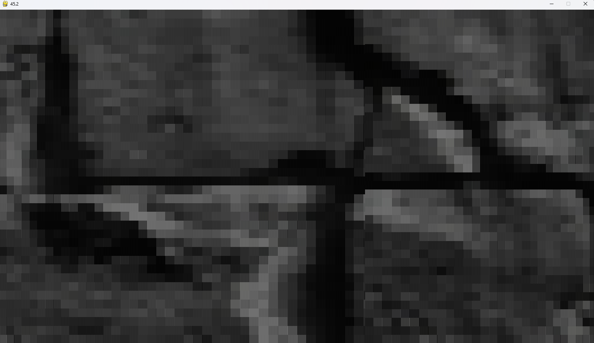
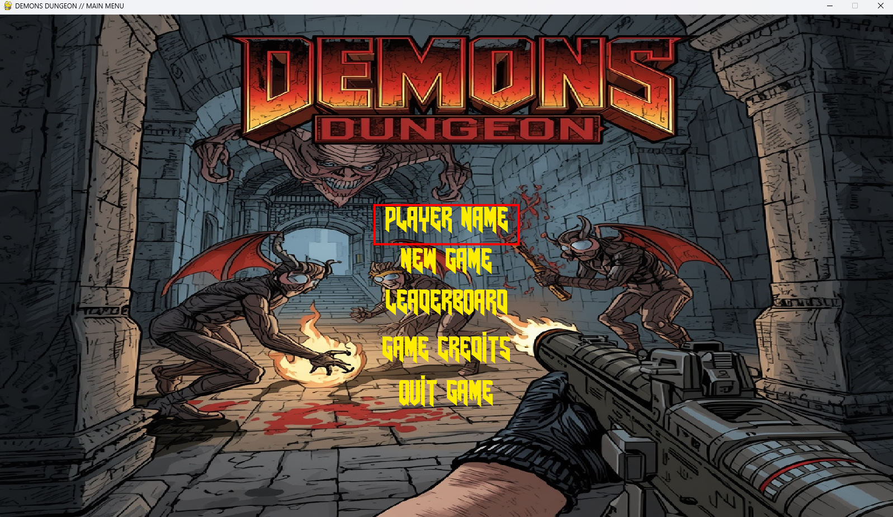
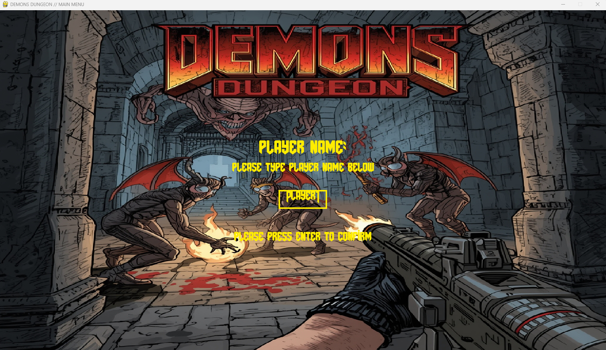
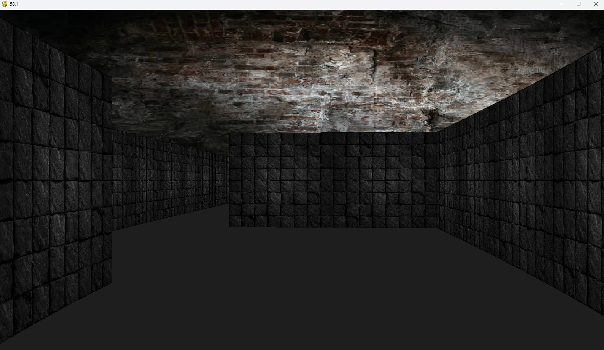
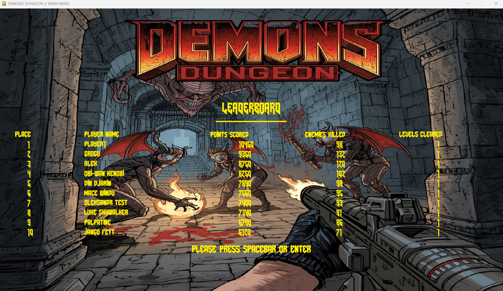
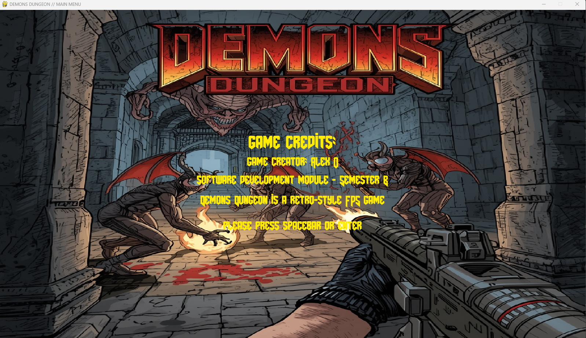
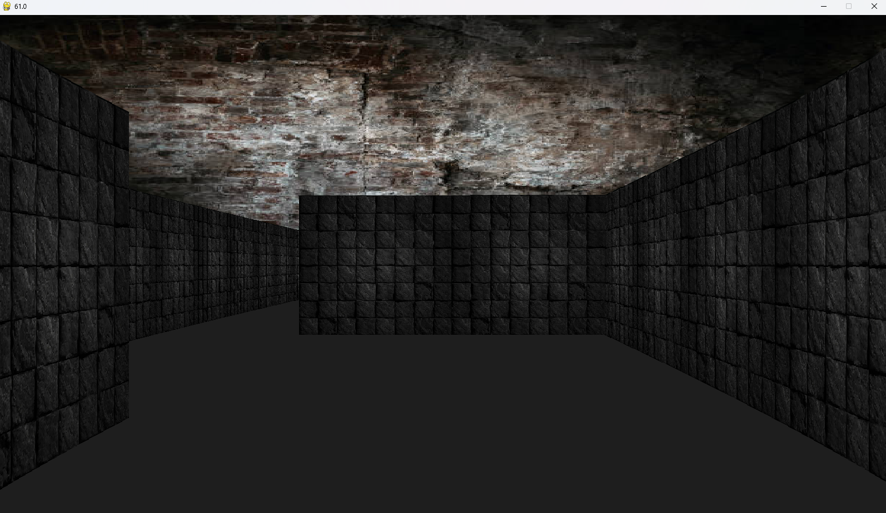
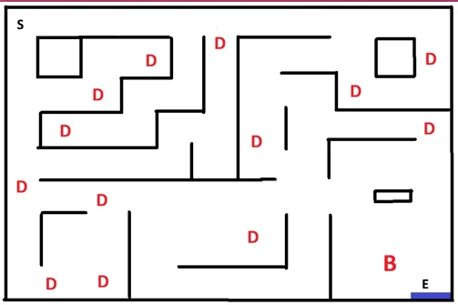
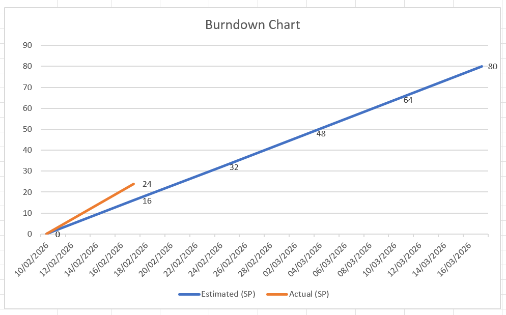

# Software Development - Semester B - Demons Dungeon retro-style first-person shooter game  

---

## Project Overview

*Demons Dungeon* is a retro-style first-person shooter (FPS) game designed and developed as part of a Software Development module. 
The game draws inspiration from classic FPS titles such as *Doom* and *Wolfenstein 3D*, focusing on fast-paced gameplay, dungeon exploration, and combat against demonic enemies.  
The primary objective of this project is to design and implement a playable FPS prototype that demonstrates core game development concepts including player movement, weapon mechanics, enemy artificial intelligence (AI), level design, and rendering. 
The project utilises modern development tools while maintaining a retro aesthetic through low-resolution textures, pixelated visuals, and classic sound effects.  
This report documents the planning, design, implementation, testing, and evaluation of *Demons Dungeon* first-person shooter game. 

---

## 1. Introduction

First-person shooter games have remained one of the most popular genres in the video game industry due to their immersive gameplay and fast-paced mechanics. 
Retro-style FPS games, in particular, have seen renewed interest because of their simplicity, nostalgia, and focus on core gameplay mechanics.
The motivation behind *Demons Dungeon* is to recreate the feel of classic FPS games while applying modern software development practices. 

---

## User and System Requirements  

In this section user and system requirements are captured in the form of Scrum-style user stories and acceptance criteria.

---

### 1. User Requirements

User requirements describe the player's expectations and desired experiences.
For each of the user requirements below, a Scrum-style user story is provided along with specific acceptance criteria to ensure that the requirement is met effectively.
To define priorities, the MoSCoW method is used, categorising requirements as Must Have, Should Have, or Could Have based on their importance to the core gameplay experience.
The MoSCoW method is a simple, practical way to decide what really matters in a project—especially popular in software development projects when using Agile methodology.

#### UR1 – Player Movement and Control
**Priority:** Must Have  

**Description:** Players must move freely through the dungeon using keyboard and mouse.

**Scrum Story:**  
> *As a player, I want to move, strafe, and aim smoothly using WASD keys and the mouse, so that I can react quickly to enemies and survive combat.*

**Acceptance Criteria:**
- Move forward, backward, and strafe using keyboard (WASD)
- Mouse controls camera rotation and aiming
- Smooth and responsive movement
- Controls explained in briefing screen

---

#### UR2 – Combat and Shooting Mechanics
**Priority:** Must Have  

**Description:** Players must be able to shoot demons using a weapon to eliminate enemies and proceed through the game level.

**Scrum Story:**  
> *As a player, I want to shoot demons using a weapon, so that I can defend myself and clear the dungeon to get to the exit.*

**Acceptance Criteria:**
- Weapon fires on left mouse button click
- Enemies take damage and die when hit
- Visual and sound feedback confirms hits
- Ammo count shown on HUD

---

#### UR3 – Health and Damage Feedback
**Priority:** Must Have  

**Description:** Players need clear feedback when taking damage and recovering health.

**Scrum Story:**  
> *As a player, I want to see my health decrease when I am hit and recover when safe, so that I can manage risk of losing the game and plan my actions.*

**Acceptance Criteria:**
- Health decreases when attacked
- Screen flashes red when damaged
- Health visible on HUD
- Health regenerates when no damage occurs

---

#### UR4 – Enemy Behaviour and Challenge
**Priority:** Must Have  

**Description:** Enemies patrol game level and chase the player when detected.

**Scrum Story:**  
> *As a player, I want enemies to patrol game level and chase me when they see me, so that the game feels challenging and immersive.*

**Acceptance Criteria:**
- Enemies follow patrol paths
- Detect/'see' and chase player
- Multiple enemy types including boss demon

---

#### UR5 – Game Progression and Win/Lose Conditions
**Priority:** Must Have  

**Description:** Clear win and lose conditions for the player.

**Scrum Story:**  
> *As a player, I want clear win and lose conditions, so that I understand my objective and outcome.*

**Acceptance Criteria:**
- Player loses when health = 0
- Player wins the game by defeating boss demon
- Game Over or Victory screen shown
- Score and stats displayed

---

#### UR6 – User Interface and HUD
**Priority:** Should Have  

**Description:** Provide clear, informative UI and menus.

**Scrum Story:**  
> *As a player, I want a clear HUD and menu system, so that I can understand my status and navigate the game easily.*

**Acceptance Criteria:**
- Main menu: Start, Leaderboard, Credits, Exit
- HUD shows health, ammo, kills, score
- Briefing screen explains controls and objectives

---

#### UR7 – Audio and Visual Feedback
**Priority:** Could Have  

**Description:** Audio and visual effects enhance immersion.

**Scrum Story:**  
> *As a player, I want sound effects and visual cues, so that combat and exploration feel immersive.*

**Acceptance Criteria:**
- Ambient dungeon music plays
- Sound effects on shooting, enemy death, damage
- Music changes during boss fights and victory

---

### 2. System Requirements

System requirements describe the **internal functionality** of the game.
Here again, in order to define priorities, the MoSCoW method is used, categorising requirements as Must Have, Should Have, or Could Have based on their importance.

#### SR1 – Game Engine and Rendering
**Priority:** Must Have  

**Description:** Render 3D-like environment using raycasting algorithm.

**Scrum Story:**  
> *As a system, I must render dungeon walls and objects using a raycasting algorithm, so that the game appears as a retro 3D FPS.*

**Acceptance Criteria:**
- Raycasting renders walls and corridors
- Perspective changes with player rotation
- Stable rendering performance

---

#### SR2 – Main Game Loop
**Priority:** Must Have  

**Description:** Continuously process input from control, game logic e.g. collision detection, enemies AI etc. and rendering updated screen.

**Scrum Story:**  
> *As a system, I must continuously process player input, game logic, and rendering, so that gameplay runs smoothly.*

**Acceptance Criteria:**
- Input captured from the control (keyboard and mouse) and processed correctly
- Game state updates correctly
- Rendering updates at a consistent frame rate

---

#### SR3 – Enemy AI System
**Priority:** Must Have  

**Description:** Manage enemy AI states like patrol, chase, attack.

**Scrum Story:**  
> *As a system, I must manage enemy AI states, so that enemies behave realistically.*

**Acceptance Criteria:**
- Enemies patrol a certain area of the game level until detecting player
- Chase and attack on detection
- Boss demon has enhanced behavior

---

#### SR4 – Collision Detection
**Priority:** Must Have  

**Description:** Prevent passing through walls and objects.

**Scrum Story:**  
> *As a system, I must detect collisions, so that movement and combat interactions are realistic.*

**Acceptance Criteria:**
- Player cannot move through walls
- Enemies respect level boundaries
- Projectiles register hits correctly

---

#### SR5 – HUD and UI Rendering
**Priority:** Should Have  

**Description:** Render UI elements on top of gameplay.

**Scrum Story:**  
> *As a system, I must display HUD elements and menus, so that players receive real-time game information.*

**Acceptance Criteria:**
- HUD updates in real time
- Menus respond to input
- Smooth screen transitions

---

#### SR6 – Audio System
**Priority:** Could Have  

**Description:** Manage background music and sound effects.

**Scrum Story:**  
> *As a system, I must play music and sound effects at appropriate times, so that the game feels immersive.*

**Acceptance Criteria:**
- Background music loops correctly and is played at the background
- Sound effects sync with actions (e.g. shooting, enemy death)
- Audio transitions for boss and victory states

---

### 3. Requirements Prioritisation Summary

| Priority | Description                                                                         |
|----------|-------------------------------------------------------------------------------------|
| **Must Have** | Core gameplay: movement, combat, AI, rendering, win/lose logic                      |
| **Should Have** | HUD, menus, UI polish, feedback                                                     |
| **Could Have** | Extra audio, collectibles, multiple weapons, leaderboard, more game levels designed |

---

## Scrum-style backlog

In this section Scrum-style product backlog is created based on the user and system requirements defined above.
The product backlog is organised into a set of epics and user stories with associated definition of done / acceptance criteria.
Each user story is assigned a priority and estimated story points to help with sprint planning and development focus.
One story point is equivalent to approximately 3 hours of work for a developer, and the total story points for each epic can help in estimating the overall effort required for that epic.

### Epic 1: Game Core Architecture

| ID     | Feature / Epic         | User Story                                                                                                                                 | Priority | Story Points | Definition of Done / Acceptance Criteria                                                                                                                                                                          |
|--------|------------------------|--------------------------------------------------------------------------------------------------------------------------------------------|----------|--------------|-------------------------------------------------------------------------------------------------------------------------------------------------------------------------------------------------------------------|
| EPIC 1 | Game Core Architecture | As a developer, I want to create the main game loop structure so that the game can update, render, and respond to user input in real time. | High     | 16           | - Game initializes successfully and remains stable.  - Game loop runs >60 FPS without crashing.  - ESC exits cleanly.  Tests: Launch game, verify loop, FPS monitor output, check memory leak logs.   |
| US 1.1 | Input System           | As a player, I want to control movement with WASD keys and with the mouse.                                                                 | High     | 8            | - Player moves forward/backward, strafes left/right.  - Mouse input triggers shooting sound and animation.  Tests: Press each control;  verify response on-screen.                                    |
| US 1.2 | Collision Detection    | As a player, I shouldn’t walk through walls or objects.                                                                                    | High     | 5            | - Player stops when colliding with wall tiles.  - No clipping through level geometry.                                                                                                                         |
| US 1.3 | Game Menu              | As a user, I want a menu to start new games, view credits, and quit.                                                                       | Medium   | 3            | - Menu buttons functional.  - Navigation intuitive.                                                                                                                                                           |

### Epic 2: Rendering & Visual System (Raycasting)

| ID     | Feature / Epic                         | User Story                                                                     | Priority | Story Points | Definition of Done / Acceptance Criteria                                                                                                                                             |
|--------|----------------------------------------|--------------------------------------------------------------------------------|----------|--------------|--------------------------------------------------------------------------------------------------------------------------------------------------------------------------------------|
| EPIC 2 | Rendering & Visual System (Raycasting) | As a player, I want a retro 3D feel via raycasting visuals for immersion.      | High     | 8            | - Basic walls rendered using raycasting.  - Movement alters perspective dynamically.  Tests: Verify wall perspective with player rotation;  check performance stability. |
| US 2.1 | Dungeon Level Rendering                | As a player, I want a dungeon labyrinth rendered where I can walk and explore. | High     | 8            | - Map correctly loads from file.  - Player spawns at “S” location.  - Textures displayed consistently.                                                                       |

### Epic 3: Enemy AI & Combat System

| ID     | Feature / Epic           | User Story                                                           | Priority | Story Points | Definition of Done / Acceptance Criteria                                                                                                               |
|--------|--------------------------|----------------------------------------------------------------------|----------|--------------|--------------------------------------------------------------------------------------------------------------------------------------------------------|
| EPIC 3 | Enemy AI & Combat System | As a player, I want to fight enemies that move, see, and chase me.   | High     | 8            | - Enemies patrol and chase when player in sight.  - Combat mechanics functional (attack, damage, kill).                                            |
| US 3.1 | Demon Patrol AI          | As a player, I want demons to patrol corridors realistically.        | High     | 3            | - Pathfinding limited to patrol sector.  - Patrol route random or predefined.                                                                      |
| US 3.2 | Chase & Combat Behavior  | As a player, I want demons to detect and attack me when I’m visible. | High     | 3            | - Detection radius system.  - Enemy moves toward player, attacks reduce health.  Tests: Step into enemy view;  observe chase/attack logic. |
| US 3.3 | Boss-Demon Encounter     | As a player, I want an end-level boss that’s harder to defeat.       | Medium   | 2            | - Special “victory” event triggers upon boss defeat.                                                                                                   |

### Epic 4: Player HUD & Stats

| ID     | Feature / Epic       | User Story                                                               | Priority | Story Points | Definition of Done / Acceptance Criteria                                                              |
|--------|----------------------|--------------------------------------------------------------------------|----------|--------------|-------------------------------------------------------------------------------------------------------|
| EPIC 4 | Player HUD & Stats   | As a player, I want to see my current health, ammo, and score.           | High     | 8            | - HUD appears during gameplay.  - Updates dynamically when stats change.                          |
| US 4.1 | Health System        | As a player, my health should decrease when hit and slowly auto-recover. | High     | 3            | - Implement health regeneration rate.  - Death triggers Game Over screen.                         |
| US 4.2 | Ammo System          | As a player, I want ammo tracking to add tactical challenge.             | Medium   | 3            | - Ammo count decreases when firing.  - Reload/top-up mechanics functional if time permits.        |
| US 4.3 | Kill Counter / Score | As a player, I want scoring for defeating enemies.                       | Medium   | 2            | - Each kill adds to counter and total points.  Tests: Kill 3 enemies, UI should show +3 increase. |

### Epic 5: Sound & Feedback Mechanics

| ID     | Feature / Epic             | User Story                                                                  | Priority | Story Points | Definition of Done / Acceptance Criteria                                                                                                          |
|--------|----------------------------|-----------------------------------------------------------------------------|----------|--------------|---------------------------------------------------------------------------------------------------------------------------------------------------|
| EPIC 5 | Sound & Feedback Mechanics | As a player, I want immersive sound and visual feedback for hits and kills. | Medium   | 4            | - Sound effects for shooting, hits, enemy death.  - Visual flash (screen reddens) when hit.  Tests: Take damage;  verify red overlay. |

### Epic 6: Game Flow & Win/Lose Conditions

| ID     | Feature / Epic                  | User Story                                                                 | Priority | Story Points | Definition of Done / Acceptance Criteria                                                          |
|--------|---------------------------------|----------------------------------------------------------------------------|----------|--------------|---------------------------------------------------------------------------------------------------|
| EPIC 6 | Game Flow & Win/Lose Conditions | As a player, I want clear winning/losing outcomes based on my performance. | High     | 4            | - Win screen upon killing boss.  - Game Over when health = 0.  - Restart options in menu. |

### Epic 7: User Interface & Screens

| ID     | Feature / Epic           | User Story                                                   | Priority | Story Points | Definition of Done / Acceptance Criteria                                                       |
|--------|--------------------------|--------------------------------------------------------------|----------|--------------|------------------------------------------------------------------------------------------------|
| EPIC 7 | User Interface & Screens | As a player, I want polished UI screens for each game phase. | Medium   | 7            | - Menu, HUD, Game Over and Victory screens functional.  - Style cohesive with retro theme. |

### Epic 8: Level Design

| ID     | Feature / Epic | User Story                                                                   | Priority | Story Points | Definition of Done / Acceptance Criteria                                                                   |
|--------|----------------|------------------------------------------------------------------------------|----------|--------------|------------------------------------------------------------------------------------------------------------|
| EPIC 8 | Level Design   | As a developer, I want a functional maze level to demonstrate core gameplay. | High     | 9            | - One level designed and implemented with enemies, boss, and exit.  - Player can fully traverse level. |

### Epic 9: Asset Integration

| ID     | Feature / Epic    | User Story                                                                                 | Priority | Story Points | Definition of Done / Acceptance Criteria                                                                         |
|--------|-------------------|--------------------------------------------------------------------------------------------|----------|--------------|------------------------------------------------------------------------------------------------------------------|
| EPIC 9 | Asset Integration | As a developer, I want to integrate sprites, textures, and ambient effects for atmosphere. | Medium   | 10           | - Demon sprites animated.  - Dungeon textures consistent.  - Ambient lighting and horror sound complete. |

### Epic 10: Testing & Optimization

| ID      | Feature / Epic         | User Story                                                              | Priority | Story Points | Definition of Done / Acceptance Criteria                                                                                                                                                                            |
|---------|------------------------|-------------------------------------------------------------------------|----------|--------------|---------------------------------------------------------------------------------------------------------------------------------------------------------------------------------------------------------------------|
| EPIC 10 | Testing & Optimization | As a developer, I need to test frame rate, AI, collision, and gameplay. | High     | 6            | - Minimum 60 FPS across system.  - No crash after 10 mins gameplay.  - All UI elements update properly.  Tests: Gameplay diagnostics report;  FPS counter logs;  AI behavior test cases manual. |

---

### Sprint Planning

Based on the above product backlog, the development can be organised into sprints, with each sprint focusing on a specific set of features or epics.
The sprint planning is designed to ensure that core gameplay mechanics are developed first, followed by additional features and polish in later sprints.
Each sprint is estimated to last 1 week, allowing for focused development and testing of the assigned features.
The start of the first sprint is set for 10.02.2026, and the end of the last sprint is planned for 17.03.2026, giving a total of 5 sprints to complete the project before the final deadline on 20.03.2026.

| Sprint   | Goals                                                                                           | Focused Features |
|----------|-------------------------------------------------------------------------------------------------|------------------|
| Sprint 1 | Game loop setup, input system                                                                   | EPIC 1           |
| Sprint 2 | Raycasting visual engine,  Enemy AI & basic combat                                          | EPIC 2, 3        |
| Sprint 3 | HUD, health, and scoring,  Sound & Feedback Mechanics,  Game Flow & Win/Lose Conditions | EPIC 4, 5, 6     |
| Sprint 4 | User Interface & Screens,  Level Design                                                     | EPIC 7 & 8       |
| Sprint 5 | Asset Integration,  Testing & Optimization                                                  | EPIC 9 & 10      |

---

## Testing

In this section, test cases are defined to verify the functionality of the game based on the user and system requirements.
The test cases cover various aspects of the game, including player movement, combat mechanics, enemy behavior, health system, win/lose conditions, rendering, HUD updates, audio feedback, and performance. 
Each test case includes a unique ID, a description of the test, preconditions that must be met before executing the test, and the expected outcome to determine if the test passes or fails.
Below is a first stab at the test cases for the game and more are to be added as the development progresses and new features are implemented.

| EPIC/US     | Test Case ID | Description                               | Precondition                                              | Expected Outcome                                                                                           | Actual result                                                                                                                                                  | Evidence                                                                                                                                       | Passed? |
|-------------|--------------|-------------------------------------------|-----------------------------------------------------------|------------------------------------------------------------------------------------------------------------|----------------------------------------------------------------------------------------------------------------------------------------------------------------|------------------------------------------------------------------------------------------------------------------------------------------------|---------|
| EPIC1/US1.1 | TC-01        | Verify player can move with WASD          | Game started                                              | When the player clicks the “A” control, they should be able to move to the left.                           | When the player clicks the “A” control, they are able to move to the left.                                                                                     |            | YES     |
| EPIC1/US1.1 | TC-02        | Verify player can move with WASD          | Game started                                              | When the player clicks the “D” control, they should be able to move to the right.                          | When the player clicks the “D” control, they are able to move to the right.                                                                                    |            | YES     |
| EPIC1/US1.1 | TC-03        | Verify player can move with WASD          | Game started                                              | When the player clicks the “W” control, they should be able to move forward.                               | When the player clicks the “W” control, they are able to move forward.                                                                                         |            | YES     |
| EPIC1/US1.1 | TC-04        | Verify player can move with WASD          | Game started                                              | When the player clicks the “S” control, they should be able to move backward.                              | When the player clicks the “S” control, they are able to move backward.                                                                                        |            | YES     |
| EPIC1/US1.1 | TC-05        | Verify player can move with mouse control | Game started                                              | When the player uses the mouse, they should be able to control which direction they are facing when moving | When the player uses the mouse, they are able to control which direction they are facing when moving                                                           |      | YES     |
| EPIC1/US1.2 | TC-06        | Verify player cannot walk through walls   | Game started                                              | Player attempts to move into a wall tile.                                                                  | Player is blocked and cannot move through the wall.                                                                                                            |            | YES     |
| EPIC1/US1.3 | TC-07        | Verify game menu functionality            | Game launched                                             | Main menu appears with options: player name, new game, leaderboard, game credits, quit game.               | Main menu appears with options: player name, new game, leaderboard, game credits, quit game.                                                                   |                                | YES     |
| EPIC1/US1.3 | TC-08        | Verify menu navigation                    | Main menu displayed. Player clicks “PLAYER NAME” button.  | Game transitions from menu to player name screen.                                                          | When the user clicks on the "PLAYER NAME" button, they are transferred to the player name screen where they can enter and save their player name.              |    | YES     |
| EPIC1/US1.3 | TC-09        | Verify menu navigation                    | Main menu displayed. Player clicks “NEW GAME” button.     | Game transitions from menu to new game.                                                                    | When the user clicks on the "NEW GAME" button, they are transferred into the game onto the game level where the user can begin the game.                       |          | YES     |
| EPIC1/US1.3 | TC-10        | Verify menu navigation                    | Main menu displayed. Player clicks “LEADERBOARD” button.  | Game transitions from menu to leaderboard screen.                                                          | When the user clicks on the "LEADERBOARD" button, they are transferred onto the leaderboard screen where they can see the leaderboard of all players.          |    | YES     |
| EPIC1/US1.3 | TC-11        | Verify menu navigation                    | Main menu displayed. Player clicks “GAME CREDITS” button. | Game transitions from menu to game credits screen.                                                         | When the user clicks on the "GAME CREDITS" button, they are transferred onto the game credits screen.                                                          |  | YES     |
| EPIC1/US1.3 | TC-12        | Verify menu navigation                    | Main menu displayed. Player clicks “QUIT GAME” button     | Game transitions from menu to exit the game.                                                               | When the user clicks on the "QUIT GAME" button, the user exits the game and the game window is closed and the user is returned back onto the operating system. |                                                                                                                                                | YES     |
| EPIC2/US2.1 | TC-13        | Verify raycasting view rendering          | Game started                                              | Dungeon walls visible with proper perspective                                                              | Dungeon walls are visible with proper perspective                                                                                                              |                      | YES     |
| EPIC2/US2.1 | TC-14        | Verify FPS performance                    | Game running > 5 min                                      | FPS ≥ 60, no freeze or crash                                                                               | FPS can be seen in the top left corner of the game screen                                                                                                      |                      | YES     |
|             | TC-18        | Verify HUD update                         | Health or ammo changes                                    | HUD updates in real time                                                                                   |                                                                                                                                                                |                                                                                                                                                |         |
|             | TC-19        | Verify ambient music & sound              | Game active                                               | Horror ambient and sound effects play correctly                                                            |                                                                                                                                                                |                                                                                                                                                |         |
|             | TC-13        | Verify demon chase behavior               | Player enters detection radius                            | Demon moves toward player, attacks                                                                         |                                                                                                                                                                |                                                                                                                                                |         |
|             | TC-14        | Verify health decrease and regenerate     | Player hit by enemy                                       | Health decreases, then slowly regenerates over time                                                        |                                                                                                                                                                |                                                                                                                                                |         |
|             | TC-15        | Verify win condition                      | Boss defeated                                             | Exit door unlocks, victory screen shown                                                                    |                                                                                                                                                                |                                                                                                                                                |         |
|             | TC-16        | Verify lose condition                     | Health reaches 0                                          | Game Over screen displayed                                                                                 |                                                                                                                                                                |                                                                                                                                                |         |

---

## Design, development and implementation

This section expands the project-level research, planning and implementation evidence for *Demons Dungeon* and ties together the decisions already described in this README. It documents the overall design, development strategies, game story and characters, environment and levels, gameplay systems, artwork & sound choices, player motivation loops, game rules, state diagrams, platform & implementation details, AI/technical challenges and the test plan.

### Design contract (short)

In this section, a design contract is defined for *Demons Dungeon*, outlining the key inputs, outputs, success criteria, and error modes for the game. The design contract serves as a guiding document to ensure that the development process stays aligned with the intended goals and requirements of the project.

- Inputs: Player input (keyboard: WASD, ESC, other keys; mouse movement and buttons), configuration files (map files, assets files), game settings (e.g. difficulty, sound volume).
- Outputs: Rendered frame (raycasted view + HUD), audio output (music & SFX), persistent data (leaderboard.json), in-memory game state updates (player, enemies, projectiles).
- Success criteria: Core must-have features function as acceptance criteria specify (movement, shooting, health, AI, collision, win/lose screens) and the game is playable from start to win/lose without crashes.
- Error modes: Missing asset files (fallbacks/log), badly formed map files (graceful error + fail-safe spawn), audio device unavailable (mute, fallback), extreme FPS drops (frame limiting / reduced resolution fallback).

### Design & development strategies

In this section, the design and development strategies for *Demons Dungeon* are outlined, detailing the approaches taken to ensure a structured and efficient development process. The strategies focus on incremental development, modular code design, data-driven approaches, and maintaining a lightweight engine to achieve the desired retro aesthetic and gameplay experience.

- Incremental development: follow the epics & sprint plan in this README. Implement a minimal playable loop first (player movement + raycasting + one basic enemy), then expand with AI states and HUD.
- Single-responsibility modules: separate code areas for input handling, raycasting renderer, entity management (player, enemies, projectiles), audio manager, UI screens, and persistence (leaderboard).
- Data-driven where practical: game levels and patrol routes stored as simple files or arrays so designers can edit maps and enemy waypoints without changing code (map text files or JSON).
- Lightweight engine: implement retro 3D with a raycasting renderer (no heavy 3D engine) to match the project's scope and visual goals.

### Game story, characters & motivation

In this section, the narrative elements of *Demons Dungeon* are outlined, including the story premise, main character, enemy types, and the player motivation loop. The story and characters are designed to fit the dark, horror-themed atmosphere of the game while providing clear motivations for the player's actions and progression through the game.

- Story (short): The player is an exorcist trapped in a decrepit dungeon beneath an old citadel. Demonic creatures have overrun the tunnels; defeat them, reach the boss chamber, kill the boss demon and reach exit.
- Main character: First person player. 
- Enemy types:
  - Basic: patrols small corridors, low health, melee or short-range attack.
  - Medium: patrols larger areas, medium health, ranged attack (e.g. fireball).
  - Advanced: slower, higher HP, charges at player when spotted.
  - Boss Demon: large health pool, area attacks, triggers victory on defeat.
- Player motivation loop (need/reward/challenge): Players have a clear need (survive & reach exit). They receive rewards for defeating enemies (score, ammo pickups, progression) and face escalating challenges (denser patrols, stronger enemies, boss demon).

### Environment, levels & artwork descriptions

In this section, the design choices for the game environment, level design, and artwork are outlined, detailing how they contribute to the overall atmosphere and gameplay experience of *Demons Dungeon*. The environment is designed to evoke a dark, foreboding dungeon atmosphere consistent with the game's theme, while the level design focuses on creating engaging and challenging layouts for players to navigate. The artwork is crafted to enhance the retro aesthetic of the game while providing clear visual cues for gameplay.

- Environment: low-res textures in `assets/menu/` and true-type font in `assets/font/` are used for menus and HUD labels; wall and floor textures should be stored in `assets/textures/` and loaded by the renderer. The visual aesthetic is intentionally pixelated and limited palette.
- Level design: primary level is a maze-like dungeon represented by a 2D grid map. Example encoding: 1 = wall, 0 = floor, S = spawn, B = boss room. 
- Artwork: sprites for enemies and weapons use simple frames to convey animation. Fonts (AmazDooM family in `assets/font/`) give the retro look. Keep sprite sheets small and consistent (64x64 or 128x128 frames) to match raycasting scale.

### Game level design

The sample game level design is presented on the following image.
S - denotes the player spawn point, B denotes the boss demon room, D denotes various demons spawn points, and E denotes the exit door that unlocks after defeating the boss demon.
The level is designed to be a maze-like dungeon with multiple corridors and rooms, providing opportunities for exploration and combat encounters with enemies. 
The layout encourages players to navigate from the top left spawn point through the environment strategically while facing challenges from patrolling demons and ultimately reaching the boss demon in the bottom right chamber.

### Gameplay systems and rules

In this section, the core gameplay systems and rules of *Demons Dungeon* are outlined, detailing how the player interacts with the game world, how combat mechanics function, and the behavior of enemies. The systems are designed to create an engaging and challenging experience while adhering to the retro aesthetic and mechanics inspired by classic FPS games.

- Movement & collision: WASD moves, mouse rotates view, movement blocked by walls. Player cannot walk through walls or overlapping hitboxes.
- Shooting/combat: left mouse button fires; hits determined via ray-based hit testing against enemies in front.
- Health & regeneration: player health reduces on hits; when not in combat, a slow regeneration begins (configurable rate).
- Enemy AI states:
  - Patrol: follow waypoints; if player enters detection radius and line-of-sight (LOS), switch to Chase.
  - Chase: move toward player; if in attack range, Attack state.
  - Attack: perform attack animation and apply damage; after losing LOS for a timeout, return to Patrol.
  - Dead: play death animation.
- Win/Lose: lose when health <= 0 (Game Over screen). Win when Boss Demon HP <= 0 and player reached the exit (Victory screen and persistent score saved to leaderboard).

### Game & motivation loops (player state, need, reward & challenge)

In this section, the game loop and player motivation loop are described in detail, outlining the core mechanics of the game and how they interact to create an engaging gameplay experience. The game loop focuses on the continuous cycle of player actions and game responses, while the motivation loop emphasizes the player's goals, rewards, and challenges that drive their engagement with the game.

- Player state: {health, ammo, score, position, currentWeapon}
- Need: survive & reach boss demon, maintain ammo and health.
- Reward: +score per kill, unlocking new area after clearing room.
- Challenge: enemy variety and patrol density.
- Loop design: short loops (kill enemies -> immediate reward) and long loops (clear level -> boss -> victory) are balanced to keep player engaged.

### UI & Controls Design

In this section, the design choices for the user interface (UI) and controls of the game are outlined, detailing how players will interact with the game and receive feedback on their actions. The UI is designed to be clear and informative while maintaining the retro aesthetic of the game, and the controls are designed to be intuitive and responsive to enhance the gameplay experience.

- Controls: WASD (movement), Mouse (aim & click to shoot), ESC (pause/exit), R or other key for interactions (reload if implemented), E for pickups.
- HUD: persistent top/bottom overlay showing Health bar, Ammo count, Kill count/Score, optionally also showing mini notifications ("Low on health").
- Menus: main menu (Player Name, New Game, Leaderboard, Game Credits, Quit Game) loaded from `menu.py` and images in `assets/menu/`.
- Accessibility: keep key bindings configurable via a small settings dictionary.

### Programming language & platform

In this section, the programming language and platform choices for the development of the game are outlined. The chosen language and platform should support the requirements of the game while allowing for efficient development and a smooth gameplay experience.

- Primary language: Python 3.12. 
- Game engine: the rendering/input/audio stack is implemented with Pygame.
- Platform: cross-platform desktop (Windows primary development environment). Persisted data uses simple JSON files e.g. game's leaderboard data.

### State diagrams (textual)

In this section, state diagrams for the player and enemy AI are described in text form, outlining the various states and transitions that occur during gameplay. These diagrams help to visualize the flow of actions and reactions for both the player and enemies, providing a clear framework for implementing the game logic.

- Player state diagram:
  Spawn -> Idle -> (WASD/mouse input) -> Move -> (left mouse) -> Shoot -> (ammo checks)-> Reload/Idle
  Move -> Collide -> Stop
  Idle -> Damaged -> (health>0) -> Idle or Dead -> Game Over
  Dead -> Game Over -> Menu

- Enemy state diagram:
  Spawn -> Patrol -> [if player detected & in the line of sight] -> Chase -> [if in attack range] -> Attack -> [if player lost] -> Search -> [timeout] -> Patrol
  Any state -> (HP <= 0) -> Dead -> Remove/Corpse

### Classes and objects design

In this section, the design choices for classes and objects in the game are outlined, detailing their responsibilities, interactions, and how they contribute to the overall architecture of the game. The design focuses on creating a modular and maintainable codebase that allows for easy expansion and modification as the game evolves.

| Class Name    | File name        | Description                                                     | Responsibilities                                                                                     | Interactions                                                      |
|---------------|------------------|-----------------------------------------------------------------|------------------------------------------------------------------------------------------------------|-------------------------------------------------------------------|
| Menu          | menu.py          | Manages the main menu and UI screens.                           | Display main menu, handle navigation to player name input, leaderboard, game credits, and quit game. | Interacts Game (to start new game)                                |
| Game          | game.py          | Main class that manages the game loop, state, and overall flow. | Initialize game components, manage game states (playing, game over/won), handle input and rendering. | Interacts SoundManager                                            |
| SoundManager  | sound_manager.py | Manages all audio aspects of the game.                          | Load and play background music and sound effects, manage audio transitions.                          | Interacts Game                                                    |
| Player        | player.py        | Represents the player character and its state.                  | Handle player attributes (health, ammo, score), manage movement and shooting mechanics.              | Interacts Game                                                    |
| LevelMap      | level_map.py     | Represents the game level layout and map data.                  | Load map from file, manage wall/floor data.                                                          | Interacts Game                                                    |
| RenderEngine  | render_engine.py | Handles the rendering of the game environment.                  | Render walls, floors, and sprites based on player position and view.                                 | Interacts Game, Raycaster                                         |
| Raycaster     | raycaster.py     | Implements the raycasting algorithm for rendering.              | Cast rays to determine visible walls and sprites, calculate perspective.                             | Interacts RenderEngine                                            |

### NPC design

In this section, the design choices for non-player characters (NPCs) in the game are outlined, detailing their roles, behaviors, and how they contribute to the gameplay experience. The NPCs are designed to enhance the atmosphere of the dungeon and provide challenges for the player through their interactions and combat mechanics.
All NPCs in the game represent enemies and are designed to fit the retro, pixelated style of the game, with simple yet distinct sprites that allow players to easily identify different types of enemies and their behaviors.

#### Demons Dungeon: Infernal Bestiary

| Demon Name            | Combat Role       | Lore & Description                                                                                                         | Attack Power  | Visual Appearance                                                                                                                  |
|:----------------------|:------------------|:---------------------------------------------------------------------------------------------------------------------------|:--------------|:-----------------------------------------------------------------------------------------------------------------------------------|
| **1. Dreg-Husk**      | Fodder / Shield   | Souls tortured until only a physical shell remains. They wander aimlessly but swarm the player to block movement.          | **Low**       | Pale, hairless humanoid with no eyes (skin grown over sockets). Chains drag from their ankles.                                     |
| **2. Pyre-Imp**       | Ranged Harasser   | Low-ranking demons formed from molten earth. They cling to walls and ledges, raining fire down on intruders.               | **Medium**    | Small, hunched creature made of cracked obsidian skin with magma glowing in the cracks. Spikes protrude from its back.             |
| **3. Ocularis**       | Flying Support    | A watcher demon that floats high above. It alerts other demons to your location and spits blinding venom.                  | **Low**       | A giant floating eyeball trailed by severed optic nerves and tentacles. It pulses purple when attacking.                           |
| **4. Bone-Construct** | Hitscan / Sniper  | A skeleton fused with demonic machinery. It prefers long hallways where its instant-hit railgun is most effective.         | **High**      | A tall skeleton wearing rusty iron greaves. Its right arm is replaced by a long, metallic barrel fused to the ulna.                |
| **5. Abyssal Lord**   | Mini-Boss         | A general of the hell armies. Requires heavy ordinance (Rockets/BFG) to defeat. It commands the arena.                     | **Very High** | Standing 10ft tall with deep red skin and massive ram horns. It carries a glowing green rune-sword and has hooved feet.            |

### Sprites and textures design

In this section, the design choices for sprites and textures used in the game are outlined, detailing the visual style, sources of assets, and how they contribute to the overall atmosphere and gameplay experience. The design focuses on creating a cohesive aesthetic that matches the retro, pixelated style inspired by classic Doom games while ensuring clarity and functionality in gameplay.

#### Sprite design

In this section, the design of sprites for the player, enemies, and other interactive elements is described. The sprites are designed to be simple yet visually distinct to ensure that players can easily identify different entities in the game. The use of a limited color palette and pixel art style contributes to the retro aesthetic.

| Asset Type                      | Description                                                                                             | Source                                                          | Notes                                                                                                                       |
|---------------------------------|---------------------------------------------------------------------------------------------------------|-----------------------------------------------------------------|-----------------------------------------------------------------------------------------------------------------------------|
| Game level ambient sprites      | Static sprites for environmental details (e.g. torches, blood stains)                                   | Custom-designed or sourced from free pixel art sprite libraries | Used to enhance the atmosphere without cluttering the visual space                                                          |
| Game level animated sprites     | Animated sprites for dynamic elements (e.g. flickering torches, moving shadows)                         | Custom-designed or sourced from free pixel art sprite libraries | Should be subtle to avoid distracting from gameplay                                                                         |
| Dreg-Husk animated sprites      | A set of frames for the Dreg-Husk demon, showing idle, walking, and attacking animations                | Custom-designed using pixel art tools                           | Should be visually distinct and fit the retro theme                                                                         |
| Pyre-Imp animated sprites       | A set of frames for the Pyre-Imp demon, showing idle, flying, and attacking animations                  | Custom-designed using pixel art tools                           | Should be visually distinct and fit the retro theme                                                                         |
| Ocularis animated sprites       | A set of frames for the Ocularis demon, showing idle floating and attacking animations                  | Custom-designed using pixel art tools                           | Should be visually distinct and fit the retro theme                                                                         |
| Bone-Construct animated sprites | A set of frames for the Bone-Construct demon, showing idle, walking, and attacking animations           | Custom-designed using pixel art tools                           | Should be visually distinct and fit the retro theme                                                                         |
| Abyssal Lord animated sprites   | A set of frames for the Abyssal Lord boss demon, showing idle, walking, attacking, and death animations | Custom-designed using pixel art tools                           | Should be visually distinct and fit the retro theme; boss should have a more elaborate sprite set to reflect its importance |

#### Texture design

In this section, the design of textures for walls, floors, and other environmental elements is described. The textures are created to be low-resolution and pixelated, consistent with the overall visual style of the game. The choice of textures helps to create an immersive dungeon atmosphere while maintaining clarity for navigation and gameplay.

| Asset Type               | Description                                                                        | Source                                                             | Notes                                                                   |
|--------------------------|------------------------------------------------------------------------------------|--------------------------------------------------------------------|-------------------------------------------------------------------------|
| Dungeon wall textures    | Low-res, pixelated textures for walls and corridors                                | Custom-designed or sourced from free pixel art texture libraries   | Should be consistent in style and color palette to maintain immersion   |
| Floor textures           | Simple, repeating textures for floors                                              | Custom-designed or sourced from free pixel art texture libraries   | Should contrast with wall textures for clarity                          |
| Game over texture        | A pixelated "Game Over" graphic to display when the player loses                   | Custom-designed using pixel art tools                              | Should be visually striking and fit the retro theme                     |
| Victory texture          | A pixelated "Victory" graphic to display when the player wins                      | Custom-designed using pixel art tools                              | Should be celebratory and fit the retro theme                           |
| Dungeon ambient textures | Additional textures for environmental details (e.g. cracks, stains)                | Custom-designed or sourced from free pixel art texture libraries   | Used to enhance the atmosphere without cluttering the visual space      |
| Dungeon exit texture     | A distinct texture for the exit door that becomes visible after defeating the boss | Custom-designed to stand out from other textures                   | Should be easily identifiable to guide the player towards the exit      |
| Dungeon ceiling textures | Optional textures for ceilings to add depth to the environment                     | Custom-designed or sourced from free pixel art texture libraries   | Can be used to enhance the visual variety of the dungeon                |

### Feedback mechanics design

#### Visual feedback

In this section, the visual feedback mechanics for the game are outlined, detailing how the game will visually communicate important events to the player, such as taking damage, hitting enemies, and defeating the boss. The table below summarizes the key aspects of visual feedback, their purpose, implementation details, and any additional notes.

| Aspect              | Purpose                                                                  | Details                                                                   | Implementation                                                                                    | Notes                                                                       |
|---------------------|--------------------------------------------------------------------------|---------------------------------------------------------------------------|---------------------------------------------------------------------------------------------------|-----------------------------------------------------------------------------|
| Player takes damage | Provide a clear, immediate visual cue to the player                      | Screen briefly flashes red to indicate harm                               | Overlay a semi-transparent red rectangle on the screen for a short duration after taking damage   | Flash intensity can be proportional to the amount of damage taken           |
| Enemy hit           | Confirm to the player that their attack was successful                   | Enemy sprite briefly flashes white or red                                 | Change the enemy sprite color to white/red for a few frames when hit                              | Can also include a brief animation (e.g. recoil) for stronger feedback      |
| Enemy death         | Indicate that an enemy has been defeated                                 | Enemy sprite plays a death animation and disappears                       | Trigger a death animation sequence and then remove the enemy from the game world                  |                                                                             |
| Health regeneration | Show that the player is recovering health over time                      | Important to allow player contiue playing the game and shoot more enemies | Player's health indicator on HUD increases in value                                               |                                                                             |
| Boss defeat         | Celebrate the player's victory and signal the end of the game            | Screen flashes bright, followed by a transition to the victory screen     | Implement a bright flash effect and then load the victory screen after a short delay              | Can also include a unique animation or visual effect for defeating the boss |
| Weapon firing       | Provide feedback that the player's attack action has been registered     | Muzzle flash effect at the weapon's position when shooting                | Render a brief muzzle flash sprite or particle effect when the player fires their weapon          | Can be enhanced with screen shake for more impact                           |

#### Audio feedback

In this section, the audio feedback mechanics for the game are outlined, detailing how the game will use sound effects and music to enhance immersion and provide cues to the player about important events such as taking damage, hitting enemies, and defeating the boss. The table below summarizes the key aspects of audio feedback, their purpose, implementation details, and any additional notes.

| Aspect              | Purpose                                                                | Details                                                                                  | Implementation                                                                                                    | Notes                                                                                               |
|---------------------|------------------------------------------------------------------------|------------------------------------------------------------------------------------------|-------------------------------------------------------------------------------------------------------------------|-----------------------------------------------------------------------------------------------------|
| Player takes damage | Provide an auditory cue that the player has been hit                   | A distinct pain sound effect plays when the player takes damage                          | Play a preloaded pain sound effect from the audio manager when the player's health decreases due to enemy attacks | Sound can vary based on the amount of damage taken (e.g. different sounds for minor vs major hits)  |
| Enemy hit           | Confirm to the player that their attack was successful                 | A distinct hit sound effect plays when an enemy is hit                                   | Play a preloaded hit sound effect when the player's attack successfully hits an enemy                             | Can be enhanced with a brief audio cue for critical hits or headshots                               |
| Enemy death         | Indicate that an enemy has been defeated                               | A death sound effect plays when an enemy is killed                                       | Play a preloaded death sound effect when an enemy's health reaches zero                                           |
| Boss defeat         | Celebrate the player's victory and signal the end of the game          | A unique victory sound effect plays when the boss is defeated                            | Play a special victory sound effect when the boss demon is defeated                                               | Can be a longer, more triumphant piece of music to enhance the sense of accomplishment              |
| Weapon firing       | Provide feedback that the player's attack action has been registered   | A gunshot sound effect plays when the player shoots                                      | Play a preloaded gunshot sound effect each time the player fires their weapon                                     | Can be enhanced with different sounds for different weapons if implemented                          |
| Enemy attack        | Alert the player that an enemy is attacking or has detected them       | A distinct alert sound plays when an enemy detects the player or initiates an attack     | Play a preloaded alert sound effect when an enemy transitions from patrol to chase or attack state                | Can be used to increase tension and encourage player awareness of their surroundings                |

#### Game state feedback

In this section, the game state feedback mechanics for the game are outlined, detailing how the game will communicate important state changes to the player, such as winning or losing the game. The table below summarizes the key aspects of game state feedback, their purpose, implementation details, and any additional notes.

| Aspect              | Purpose                                                                | Details                                                                   | Implementation                                                                                  | Notes                                                                                                                                           |
|---------------------|------------------------------------------------------------------------|---------------------------------------------------------------------------|-------------------------------------------------------------------------------------------------|-------------------------------------------------------------------------------------------------------------------------------------------------|
| Win condition       | Provide a clear indication that the player has won the game            | Transition to a victory screen with celebratory visuals and music         | Load a victory screen with unique graphics and play a victory music track when the player defeats the boss demon | Can also include a summary of the player's performance (e.g. score, time taken) on the victory screen                          |
| Lose condition      | Provide a clear indication that the player has lost the game           | Transition to a game over screen with appropriate visuals and music       | Load a game over screen with somber graphics and play a game over music track when the player's health reaches zero | Can also include an option to restart the game or return to the main menu from the game over screen                         |
| HUD updates         | Keep the player informed of their current status (health, ammo, score) | The HUD dynamically updates to reflect changes in health, ammo, and score | Implement a HUD that displays health bars, ammo count, and score, and ensure it updates in real time as the player's status changes | The HUD design should be clear and unobtrusive to maintain immersion while providing essential information  |

---

## Regular backlog reviews and development review meetings

In this section evidence of regular backlog reviews, a maintained burndown chart and development review meetings are documented.

### Backlog review, burndown chart and development review meeting on 18.02.2026 for the accomplished Sprint 1

The Sprint 1 has finished on 17.02.2026 and the backlog review and sprint review meeting have been conducted on 18.02.2026. 
During the backlog review, the progress made during Sprint 1 has been assessed.
From backlog point of view Epic 1 with all three user stories US 1.1, US 1.2, US 1.3 has been fully completed.
Moreover, Epic 2 with its user story US 2.1 has been completed as well despite it has been planned for Sprint 2.

The burndown chart for Sprint 1 is shown below, indicating the progress made in completing the tasks and user stories planned for the sprint 1 from the scrum backlog.

From the development review point of view the following has been accomplished during Sprint 1:

*Design:*
- Produced design contract.
- Defined development strategies.
- Produced game story, characters and motivation loop.
- Captured environment, levels and artwork descriptions.
- Designed game level and gameplay systems and rules.
- Designed game and motivation loops.
- Captured UI and controls.
- Defined programming language and platform.
- Designed state diagrams for player and enemy AI.
- Designed 7 classes for the game.
- Described NPCs and their behaviors.
- Described sprites and textures for the game.
- Designed game level.
- Designed visual, audio and game state feedback mechanics.

*Coding:*
- Created game menu with options for entering player name, starting a new game, viewing the leaderboard, viewing game credits and exiting the game.
- Set up the main game loop and input handling.
- Implemented basic player movement and collision detection.
- Implemented a simple raycasting renderer to display the environment.
- Created a game level map and loaded it into the game.
- Created several textures for walls and also a texture for the exit door.
- Implemented background music to play Doom theme mp3 during gameplay.

*Testing:*
- Tested player movement and collision detection to ensure smooth navigation through the environment.
- Tested raycasting renderer to ensure correct rendering of walls and textures.
- Tested game level loading to ensure the map is correctly represented in the game.
- Tested background music playback to ensure it plays correctly during gameplay.
- Tested main game menu functionality to ensure all options work as intended (e.g. starting a new game, viewing leaderboard, etc.).
- Tested main game loop to ensure it runs smoothly without crashes or major bugs during gameplay.

*Blockers:*

No blockers have been encountered during Sprint 1. All planned tasks and user stories have been completed successfully, and the development process has proceeded as expected without any major issues or obstacles.

*Plan for the next sprint:*

For the next sprint, the focus will be on implementing Epic 3 - "Enemy AI & basic combat" and Epic 4 - "HUD, health, and scoring".  
Additionally, more sprites and textures will be created for environmental details to enhance the visual experience of the game.

---

## References

1. Free Doom-style font: https://fontmeme.com/fonts/amazdoom-font/
2. SLADE editor for map design and working with WAD files: https://slade.mancubus.net/
3. Pygame documentation: https://www.pygame.org/docs/
4. Doom-style weapon sprites: https://www.realm667.com/repository/armory/doom-style
5. Sprites for monsters: https://github.com/Realm667/HPack/tree/master/pk3/sprites/Monsters