# Software Development - Semester B - Demons Dungeon retro-style first-person shooter game  

---

## Project Overview

*Demons Dungeon* is a retro-style first-person shooter (FPS) game designed and developed as part of a Software Development module. 
The game draws inspiration from classic FPS titles such as *Doom* and *Wolfenstein 3D*, focusing on fast-paced gameplay, dungeon exploration, and combat against demonic enemies.  
The primary objective of this project is to design and implement a playable FPS prototype that demonstrates core game development concepts including player movement, weapon mechanics, enemy artificial intelligence (AI), level design, and rendering. 
The project utilises modern development tools, programming language and framework while maintaining a retro aesthetic through low-resolution textures, pixelated visuals, and classic sound effects.  
This report represents 'Game Design Document' and it documents the planning, design, implementation, testing, and evaluation of *Demons Dungeon* first-person shooter game. 

---

## 1. Introduction

First-person shooter games have remained one of the most popular genres in the video game industry due to their immersive gameplay and fast-paced mechanics. 
Retro-style FPS games, in particular, have seen renewed interest because of their simplicity, nostalgia, and focus on core gameplay mechanics.
The motivation behind *Demons Dungeon* is to recreate the feel of classic FPS games while applying modern software development practices. 

---

## User and System Requirements  

In this section user and system requirements are captured in the form of Scrum-style user stories and acceptance criteria.

---

### 1. User Requirements

User requirements describe the player's expectations and desired experiences.
For each of the user requirements below, a Scrum-style user story is provided along with specific acceptance criteria to ensure that the requirement is met effectively.
To define priorities, the MoSCoW method is used, categorising requirements as Must Have, Should Have, or Could Have based on their importance to the core gameplay experience.
The MoSCoW method is a simple, practical way to decide what really matters in a project—especially popular in software development projects when using Agile methodology.

#### UR1 – Player Movement and Control

**Priority:** Must Have  

**Description:** Players must move freely through the dungeon using keyboard and mouse.

**Scrum Story:**  
> *As a player, I want to move, strafe, and aim smoothly using WASD keys and the mouse, so that I can react quickly to enemies and survive combat.*

**Testing and acceptance Criteria:**
- Player moves forward, backward, and strafe left and right using keyboard (WASD)
- Player uses mouse to control camera rotation left and right and aim at enemies
- Smooth and responsive movement


---

#### UR2 – Combat and Shooting Mechanics
**Priority:** Must Have  

**Description:** Players must be able to shoot demons using a weapon to eliminate enemies and proceed through the game level.

**Scrum Story:**  
> *As a player, I want to shoot demons using a weapon, so that I can defend myself and clear the dungeon to get to the exit.*

**Testing and acceptance Criteria:**
- Weapon fires on left mouse button click
- Enemies take damage and die when hit
- Visual and sound feedback confirms hits
- Ammo count shown on HUD

---

#### UR3 – Health and Damage Feedback
**Priority:** Must Have  

**Description:** Players need clear feedback when taking damage and recovering health.

**Scrum Story:**  
> *As a player, I want to see my health decrease when I am hit and recover when safe, so that I can manage risk of losing the game and plan my actions.*

**Testing and acceptance Criteria:**
- Health decreases when attacked and hit by an enemy
- Screen flashes red when player is hit
- Health status is visible on HUD
- Health regenerates when no damage to the player occurs

---

#### UR4 – Enemy Behaviour and Challenge
**Priority:** Must Have  

**Description:** Enemies inhabit game level and chase the player when detected.

**Scrum Story:**  
> *As a player, I want enemies to inhabit game level and chase me when they see me, so that the game feels challenging and immersive.*

**Testing and acceptance Criteria:**
- Enemies reside at various places on thegame level
- When player enters enemy's line of sight player is detected and enemy chases player
- Game level has multiple enemy types with different characteristics of strength and level of damage including boss demon

---

#### UR5 – Game Progression and Win/Lose Conditions
**Priority:** Must Have  

**Description:** Clear win and lose conditions for the player.

**Scrum Story:**  
> *As a player, I want clear win and lose conditions, so that I understand my objective how to win the game.*

**Testing and acceptance Criteria:**
- Player loses the game when player's health reaches 0
- Player wins the game by defeating boss demon and reaching the exit door
- When the game is lost then Game Over screen is shown
- When the game is won then Victory screen is shown

---

#### UR6 – User Interface and HUD
**Priority:** Should Have  

**Description:** Provide clear, informative UI and menus.

**Scrum Story:**  
> *As a player, I want a clear HUD and menu system, so that I can understand my status and navigate the game easily.*

**Testing and acceptance Criteria:**
- Main menu is present with options: Player Name, New Game, Leaderboard, Game Credits, Quit Game
- HUD shows health, ammo, kills, score, game level


---

#### UR7 – Audio and Visual Feedback
**Priority:** Could Have  

**Description:** Audio and visual effects enhance immersion.

**Scrum Story:**  
> *As a player, I want sound effects and visual cues, so that combat and exploration feel immersive.*

**Testing and acceptance Criteria:**
- Ambient dungeon music plays when game starts and player is exploring the level
- Sound effects on shooting, enemy death, player's damage, enemy's attack, enemy’s pain, weapon shooting
- Visual feedback when player's is hit (e.g. screen flashes red and health reduces) 
- Visual feedback when enemy is hit (e.g. enemy's pain is animated)
- Visual feedback when enemy dies (e.g. enemy's death is animated)
- Visual feedback when weapon is fired (e.g. shotgun firing animation is played)

---

### 2. System Requirements

System requirements describe the **internal functionality** of the game.
Here again, in order to define priorities, the MoSCoW method is used, categorising requirements as Must Have, Should Have, or Could Have based on their importance.

#### SR1 – Game Engine and Rendering
**Priority:** Must Have  

**Description:** Render 3D-like environment using raycasting algorithm.

**Scrum Story:**  
> *As a system, I must render dungeon walls and objects using a raycasting algorithm, so that the game appears as a retro 3D FPS.*

**Testing and acceptance Criteria:**
- Raycasting algorithm renders walls and corridors for the dungeon game level
- Perspective changes with player rotation
- Stable rendering performance without significant frame drops, visual glitches, or crashes

---

#### SR2 – Main Game Loop
**Priority:** Must Have  

**Description:** Continuously process input from control, game logic e.g. collision detection, enemies AI etc. and rendering updated screen.

**Scrum Story:**  
> *As a system, I must continuously process player input, game logic, and rendering, so that gameplay runs smoothly.*

**Testing and acceptance Criteria:**
- Input captured from the control (keyboard and mouse) and processed correctly
- Game state updates correctly (e.g. player movement and collision detection, enemy AI, health changes)
- Weapon firing is animated and sound effects are played when shooting
- Enemies are updated based on their AI states (patrol, chase, attack)
- Win and lose conditions are checked and triggered appropriately
- Rendering engine redraws and updates the screen at a consistent frame rate

---

#### SR3 – Enemy AI System
**Priority:** Must Have  

**Description:** Manage enemy AI states like patrol, chase, attack.

**Scrum Story:**  
> *As a system, I must manage enemy AI states, so that enemies behave realistically.*

**Testing and acceptance Criteria:**
- Enemies occupy a certain area of the game level until detecting player
- When player enters enemy's line of sight then chase and attack
- Boss demon has enhanced characteristics so harder to be killed than regular demons

---

#### SR4 – Collision Detection
**Priority:** Must Have  

**Description:** Prevent passing through walls and objects.

**Scrum Story:**  
> *As a system, I must detect collisions, so that movement and combat interactions are realistic.*

**Testing and acceptance Criteria:**
- Player can't move through walls
- Enemies respect level boundaries and can't move through the walls
- Projectiles register hits correctly

---

#### SR5 – HUD and UI Rendering
**Priority:** Should Have  

**Description:** Render UI elements on top of gameplay.

**Scrum Story:**  
> *As a system, I must display HUD elements and menus, so that players receive real-time game information.*

**Testing and acceptance Criteria:**
- HUD updates in real time displaying key game status elements such as player health, ammo, kill count, score, game level
- Main game menu is rendered at the start with menu options which respond to input so that player can navigate through the menu and select options

---

#### SR6 – Audio System
**Priority:** Could Have  

**Description:** Manage background music and sound effects.

**Scrum Story:**  
> *As a system, I must play music and sound effects at appropriate times, so that the game feels immersive.*

**Testing and acceptance Criteria:**
- Background music loops correctly and is played at the background
- Sound effects sync with actions (e.g. weapon shooting sound when weapon is fired and animated, enemy death sound when enemy dies, player damage sound when player is hit, enemy attack sound when enemy attacks)


---

### 3. Requirements Prioritisation Summary

On the following table, the user and system requirements are summarised with their assigned priorities based on the MoSCoW method.

| Priority        | Description                                                                                                        |
|-----------------|--------------------------------------------------------------------------------------------------------------------|
| **Must Have**   | Core gameplay: player movement, enemies combat, enemies AI, game level rendering, win/lose logic                   |
| **Should Have** | HUD, menus, UI polish, visual and audio feedback                                                                   |
| **Could Have**  | ambient objects for immersion, extra audio, collectibles, multiple weapons, leaderboard, more game levels designed |

---

## Scrum-style backlog

In this section Scrum-style product backlog is created based on the user and system requirements defined above.
The product backlog is organised into a set of epics and user stories with associated definition of done / acceptance criteria.
Each user story is assigned a priority and estimated story points to help with sprint planning and development focus.
One story point is equivalent to approximately 3 hours of work for a developer, and the total story points for each epic can help in estimating the overall effort required for that epic.

### Epic 1: Game Core Architecture

| ID     | Feature / Epic         | User Story                                                                                                                                 | Priority | Story Points | Definition of Done / Acceptance Criteria                                                                                                                                                                          |
|--------|------------------------|--------------------------------------------------------------------------------------------------------------------------------------------|----------|--------------|-------------------------------------------------------------------------------------------------------------------------------------------------------------------------------------------------------------------|
| EPIC 1 | Game Core Architecture | As a developer, I want to create the main game loop structure so that the game can update, render, and respond to user input in real time. | High     | 16           | - Game initializes successfully and remains stable. <br/>- Game loop runs >60 FPS without crashing. <br/>- ESC exits cleanly. <br/>Tests: Launch game, verify loop, FPS monitor output, check memory leak logs.   |
| US 1.1 | Input System           | As a player, I want to control movement with WASD keys and with the mouse.                                                                 | High     | 8            | - Player moves forward/backward, strafes left/right. <br/>- Mouse input triggers shooting sound and animation. <br/>Tests: Press each control; <br/>verify response on-screen.                                    |
| US 1.2 | Collision Detection    | As a player, I shouldn’t walk through walls or objects.                                                                                    | High     | 5            | - Player stops when colliding with wall tiles. <br/>- No clipping through level geometry.                                                                                                                         |
| US 1.3 | Game Menu              | As a user, I want a menu to start new games, view credits, and quit.                                                                       | Medium   | 3            | - Menu buttons functional. <br/>- Navigation intuitive.                                                                                                                                                           |

### Epic 2: Rendering & Visual System (Raycasting)

| ID     | Feature / Epic                         | User Story                                                                     | Priority | Story Points | Definition of Done / Acceptance Criteria                                                                                                                                             |
|--------|----------------------------------------|--------------------------------------------------------------------------------|----------|--------------|--------------------------------------------------------------------------------------------------------------------------------------------------------------------------------------|
| EPIC 2 | Rendering & Visual System (Raycasting) | As a player, I want a retro 3D feel via raycasting visuals for immersion.      | High     | 8            | - Basic walls rendered using raycasting. <br/>- Movement alters perspective dynamically. <br/>Tests: Verify wall perspective with player rotation; <br/>check performance stability. |
| US 2.1 | Dungeon Level Rendering                | As a player, I want a dungeon labyrinth rendered where I can walk and explore. | High     | 8            | - Map correctly loads from file. <br/>- Player spawns at “S” location. <br/>- Textures displayed consistently.                                                                       |

### Epic 3: Enemy AI & Combat System

| ID     | Feature / Epic           | User Story                                                           | Priority | Story Points | Definition of Done / Acceptance Criteria                                                                                                               |
|--------|--------------------------|----------------------------------------------------------------------|----------|--------------|--------------------------------------------------------------------------------------------------------------------------------------------------------|
| EPIC 3 | Enemy AI & Combat System | As a player, I want to fight enemies that move, see, and chase me.   | High     | 8            | - Enemies patrol and chase when player in sight. <br/>- Combat mechanics functional (attack, damage, kill).                                            |
| US 3.1 | Demon Patrol AI          | As a player, I want demons to patrol corridors realistically.        | High     | 3            | - Pathfinding limited to patrol sector. <br/>- Patrol route random or predefined.                                                                      |
| US 3.2 | Chase & Combat Behavior  | As a player, I want demons to detect and attack me when I’m visible. | High     | 3            | - Detection radius system. <br/>- Enemy moves toward player, attacks reduce health. <br/>Tests: Step into enemy view; <br/>observe chase/attack logic. |
| US 3.3 | Boss-Demon Encounter     | As a player, I want an end-level boss that’s harder to defeat.       | Medium   | 2            | - Special “victory” event triggers upon boss defeat.                                                                                                   |

### Epic 4: Player HUD & Stats

| ID     | Feature / Epic       | User Story                                                               | Priority | Story Points | Definition of Done / Acceptance Criteria                                                       |
|--------|----------------------|--------------------------------------------------------------------------|----------|--------------|------------------------------------------------------------------------------------------------|
| EPIC 4 | Player HUD & Stats   | As a player, I want to see my current health, ammo, and score.           | High     | 8            | - HUD appears during gameplay. <br/>- Updates dynamically when stats change.                   |
| US 4.1 | Health System        | As a player, my health should decrease when hit and slowly auto-recover. | High     | 3            | - Implement health regeneration rate. <br/>- Death triggers Game Over screen.                  |
| US 4.2 | Ammo System          | As a player, I want ammo tracking to add tactical challenge.             | Medium   | 3            | - Ammo count decreases when firing. <br/>- Reload/top-up mechanics functional if time permits. |
| US 4.3 | Kill Counter / Score | As a player, I want scoring for defeating enemies.                       | Medium   | 2            | - Each kill adds to counter and total points.                                                  |

### Epic 5: Visual and Sound Feedback Mechanics

| ID     | Feature / Epic                                                            | User Story                                                                                                                     | Priority | Story Points | Definition of Done / Acceptance Criteria                                                                                                          |
|--------|---------------------------------------------------------------------------|--------------------------------------------------------------------------------------------------------------------------------|----------|--------------|---------------------------------------------------------------------------------------------------------------------------------------------------|
| EPIC 5 | Visual and Sound Feedback Mechanics                                     | As a player, I want immersive sound and visual feedback for hits and kills.                                                    | Medium   | 5            | - Sound effects for shooting, hits, enemy death. <br/>- Visual flash (screen reddens) when hit. <br/>Tests: Take damage; <br/>verify red overlay. |
| US 5.1 | shotgun rendered                                                          | As a player, I want to be able to see the shotgun being rendered on the screen.                                                | Medium   | 1            | - Shotgun visible on the screen.                                                                                                                  |
| US 5.2 | shotgun shooting animation                                                | As a player, I want to be able to see the animation for the shotgun being fired.                                               | Medium   | 1            | - Shotgun fired animation is played on the screen.                                                                                                |
| US 5.3 | shotgun fired sound                                                       | As a player, I want to be able to hear the sound of the shotgun fired.                                                         | Medium   | 1            | - Shotgun sound played upon shotgun being fired.                                                                                                  |
| US 5.4 | player pain and blood screen animation and sound when player is attacked. | As a player, I want to be able to hear the sound of the my character being damaged and want to be able to see the blood screen | Medium   | 1            | - Player damage sound and blood screen are played.                                                                                                |
| US 5.5 | demon attack, pain, death sound and visual feedback mechanics             | As a player, I want to be able to hear the sound of the demon being killed and want to be able to see how it dies.             | Medium   | 1            | - Demon death mechanics are rendered                                                                                                       |

### Epic 6: Game Flow & Win/Lose Conditions

| ID     | Feature / Epic                  | User Story                                                                 | Priority | Story Points | Definition of Done / Acceptance Criteria                                                                                                         |
|--------|---------------------------------|----------------------------------------------------------------------------|----------|--------------|--------------------------------------------------------------------------------------------------------------------------------------------------|
| EPIC 6 | Game Flow & Win/Lose Conditions | As a player, I want clear winning/losing outcomes based on my performance. | High     | 4            | - Win screen upon killing boss demon and reaching exit door. <br/>- Game Over when health = 0. <br/>- Restart the game option in main game menu. |

### Epic 7: User Interface & Screens

| ID     | Feature / Epic           | User Story                                                   | Priority | Story Points | Definition of Done / Acceptance Criteria                                                                                                 |
|--------|--------------------------|--------------------------------------------------------------|----------|--------------|------------------------------------------------------------------------------------------------------------------------------------------|
| EPIC 7 | User Interface & Screens | As a player, I want polished UI screens for each game phase. | Medium   | 7            | - Maine Game Menu, in-game HUD with real time updates, Game Over and Victory screens functional. <br/>- Style cohesive with retro theme. |

### Epic 8: Level Design

| ID     | Feature / Epic | User Story                                                                   | Priority | Story Points | Definition of Done / Acceptance Criteria                                                                   |
|--------|----------------|------------------------------------------------------------------------------|----------|--------------|------------------------------------------------------------------------------------------------------------|
| EPIC 8 | Level Design   | As a developer, I want a functional maze level to demonstrate core gameplay. | High     | 9            | - One level designed and implemented with enemies, boss, and exit. <br/>- Player can fully traverse level. |

### Epic 9: Asset Integration

| ID     | Feature / Epic    | User Story                                                                                 | Priority | Story Points | Definition of Done / Acceptance Criteria                                                                                               |
|--------|-------------------|--------------------------------------------------------------------------------------------|----------|--------------|----------------------------------------------------------------------------------------------------------------------------------------|
| EPIC 9 | Asset Integration | As a developer, I want to integrate sprites, textures, and ambient effects for atmosphere. | Medium   | 10           | - Demon sprites animated. <br/>- Dungeon textures consistent. <br/>- Ambient lighting sources present on the game level for immersion. |

### Epic 10: Testing & Optimization

| ID      | Feature / Epic         | User Story                                                              | Priority | Story Points | Definition of Done / Acceptance Criteria                                                                                                                                                                            |
|---------|------------------------|-------------------------------------------------------------------------|----------|--------------|---------------------------------------------------------------------------------------------------------------------------------------------------------------------------------------------------------------------|
| EPIC 10 | Testing & Optimization | As a developer, I need to test frame rate, AI, collision, and gameplay. | High     | 6            | - Minimum 60 FPS across system. <br/>- No crash after 10 mins gameplay. <br/>- All UI elements update properly. |

---

### Sprint Planning

Based on the above product backlog, the development can be organised into sprints, with each sprint focusing on a specific set of features or epics.
The sprint planning is designed to ensure that core gameplay mechanics are developed first, followed by additional features and polish in later sprints.
Each sprint is estimated to last 1 week, allowing for focused development and testing of the assigned features.
The start of the first sprint is set for 10.02.2026, and the end of the last sprint is planned for 17.03.2026, giving a total of 5 sprints to complete the project before the final deadline on 20.03.2026 when the final report and game prototype are to be submitted.


| Sprint   | Goals                                                                                           | Focused Features |
|----------|-------------------------------------------------------------------------------------------------|------------------|
| Sprint 1 | Game loop setup, input system                                                                   | EPIC 1           |
| Sprint 2 | Raycasting visual engine, <br/>Enemy AI & basic combat                                          | EPIC 2, 3        |
| Sprint 3 | HUD, health, and scoring, <br/>Sound & Feedback Mechanics, <br/>Game Flow & Win/Lose Conditions | EPIC 4, 5, 6     |
| Sprint 4 | User Interface & Screens, <br/>Level Design                                                     | EPIC 7 & 8       |
| Sprint 5 | Asset Integration, <br/>Testing & Optimization                                                  | EPIC 9 & 10      |

---

## Design, development and implementation

This section expands the project-level research, planning and implementation evidence for *Demons Dungeon*. It documents the overall design, development strategies, game story and characters, environment and levels, gameplay systems, artwork & sound choices, player motivation loops, game rules, state diagrams, platform & implementation details, AI/technical challenges and the test plan.


### Design contract (short)

In this section, a design contract is defined for *Demons Dungeon*, outlining the key inputs, outputs, success criteria, and error modes for the game. The design contract serves as a guiding document to ensure that the development process stays aligned with the intended goals and requirements of the project.

- Inputs: Player input (keyboard: WASD, ESC, other keys; mouse movement and left button), configuration files (map files, assets files), game settings (e.g. difficulty, sound volume).
- Outputs: Rendered frame (raycasted view + HUD), audio output (music & SFX), persistent data (leaderboard.json), in-memory game state updates (player, enemies, projectiles).
- Success criteria: Core must-have features function as acceptance criteria specify (movement, shooting, health, AI, collision, win/lose screens) and the game is playable from start to win/lose without crashes.


### Design & development strategies

In this section, the design and development strategies for *Demons Dungeon* are outlined, detailing the approaches taken to ensure a structured and efficient development process. The strategies focus on incremental development, modular code design, data-driven approaches, and maintaining a lightweight engine to achieve the desired retro aesthetic and gameplay experience.

#### Design strategies:

- Start with a minimal viable product (MVP) that includes basic player movement and raycasting rendering to establish the core gameplay loop early.
- Iteratively add features such as enemy AI, combat mechanics, and HUD elements in subsequent sprints, allowing for continuous testing and refinement.
- Use a modular design approach, separating concerns into distinct classes and modules (e.g. Player, Enemy, RenderEngine) to improve code maintainability and scalability. Place all constants into a separate configuration file to allow for easy adjustments without modifying core code. 
- For the classes and objects design, follow the Single Responsibility Principle to ensure that each class has a clear and focused purpose, which will help in maintaining a clean and modular codebase. For example, the `Player` class should only manage player-related attributes and behaviors, while the `RenderEngine` should solely handle rendering logic.
- Adopt a data-driven approach for level design, allowing for easier updates and modifications without changing core code (e.g. loading maps from files, separate files for sprites).
- Asset management: keep assets organised in a structured directory (e.g. `assets/textures/`, `assets/sprites/`, `assets/sounds/`) and load them dynamically to allow for easy updates and modifications.

#### Development strategies:

- Version control: use GitHub for source code management, with regular commits once a chunk of well tested code coveting game features is produced to ensure a clean development history.
- Incremental development: follow the epics & sprint plan in this README. Implement a minimal playable main game loop first (player movement + raycasting + one basic enemy), then expand with AI states and HUD.
- Lightweight engine: implement retro 3D with a raycasting renderer (no heavy 3D engine) to match the project's scope and visual goals.
- Use consistent coding style and clear naming conventions to improve readability and maintainability of the codebase, especially as the project grows in complexity with multiple features and systems interacting. Name all constants in uppercase to distinguish them from variables and functions.
- Before making big code commits perform deep dive code reviews and refactoring sessions to ensure code quality and address technical debt as new features are added.
- Implement getters and setters for class attributes to encapsulate data and provide controlled access, which can help in maintaining the integrity of the game state and allow for easier debugging and future modifications.
- Documentation: maintain clear documentation of code and design decisions throughout development to facilitate future maintenance and potential expansion of the game. Code should be commented throughout to make it readable, especially for complex sub-systems like the raycasting renderer and enemy AI.
- Performance optimization: monitor frame rate and optimize rendering and game logic as needed to maintain a smooth gameplay experience, especially as new features are added. Resolve any performance degradation immediately and early to ensure the game runs well on target platforms.
- Testing: perform regular playtesting after each sprint to ensure new features integrate well and meet acceptance criteria, with a focus on core gameplay mechanics and stability.
- User feedback: show progress and features being implemented to tutors to gather feedback and identify areas for improvement in gameplay, controls, and overall experience, and iterate on the design based on this feedback.


### Game story, characters & motivation

In this section, the narrative elements of *Demons Dungeon* are outlined, including the story premise, main character, enemy types, and the player motivation loop. The story and characters are designed to fit the dark, horror-themed atmosphere of the game while providing clear motivations for the player's actions and progression through the game.

- Story (short): The player is an exorcist trapped in a decrepit dungeon beneath an old citadel. Demonic creatures have overrun the tunnels; defeat them, reach the boss chamber, kill the boss demon and reach the exit door.
- Main character: First person player. Player can assign a name before the new game starts. Player is armed with a shotgun and has limited ammo and health. 
- Enemy types:
  - Basic: low health so easier to be killed, patrols small corridors, low damage when player is hit, short-range attack.
  - Medium: medium health, ranged attack, larger damage caused on player when hit, move fast.
  - Advanced: slower, higher health, charges at player when spotted.
  - Boss Demon: large health pool, area attacks and larger health damage on player, triggers victory on defeat (when exit door is reached).
- Player motivation loop (need/reward/challenge): Players have a clear need (survive & reach exit). They receive rewards for defeating enemies (score and increased kill count, progression through the game level) and face escalating challenges (denser patrols, stronger enemies, boss demon). Ultimate player's motivation is to survive the dungeon, defeat the demons, and escape through the exit door. Final reward for the player if a spot in top 10 leaderboard is secured by achieving high score from many enemies being defeated. 

### Environment, levels & artwork descriptions

In this section, the design choices for the game environment, level design, and artwork are outlined, detailing how they contribute to the overall atmosphere and gameplay experience of *Demons Dungeon*. The environment is designed to evoke a dark, foreboding dungeon atmosphere consistent with the game's theme, while the level design focuses on creating engaging and challenging layouts for players to navigate. The artwork is crafted to enhance the retro aesthetic of the game while providing clear visual cues for gameplay.

- Environment: low-res texture in `assets/menu/` and true-type font in `assets/font/` are used for the main game menu and HUD labels; wall and floor textures should be stored in `assets/textures/` and loaded by the renderer. The visual aesthetic is intentionally pixelated and limited palette. Font (AmazDooM family in `assets/font/`) give the retro Doom-style look. 
- Level design: primary level is a maze-like dungeon represented by a 2D grid map. Example encoding: 1 = wall, 0 = floor, S = spawn, B = boss room. 
- Artwork: sprites for enemies and weapons use simple frames to convey animation. Sprite are kept small and consistent (64x64 or 128x128 frames) to match raycasting scale.


### Game level design

The sample game level design is presented on the following image.
S - denotes the player spawn point, B denotes the boss demon room, D denotes various demons spawn points, and E denotes the exit door that unlocks after defeating the boss demon.
The level is designed to be a maze-like dungeon with multiple corridors and rooms, providing opportunities for exploration and combat encounters with enemies. 
The layout encourages players to navigate from the top left spawn point through the environment strategically while facing challenges from patrolling demons and ultimately reaching the boss demon in the bottom right chamber. Overall the game level is to contain a mix of narrow corridors, wider corridors and medium-sized and large open chambers where player can strafe when in combat with demons.
If time permits the game level has to contain various ambient light sources like torches and lamps to make the game level immersive. Walls are to be rendered using several textures. 

[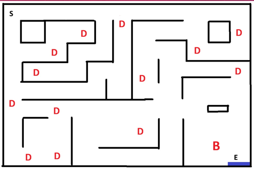](images/doc/game_level_design.png)

### Gameplay systems and rules

In this section, the core gameplay systems and rules of *Demons Dungeon* are outlined, detailing how the player interacts with the game world, how combat mechanics function, and the behavior of enemies. The systems are designed to create an engaging and challenging experience while adhering to the retro aesthetic and mechanics inspired by classic FPS games like Doom.

- Movement & collision: WASD moves, mouse rotates view, movement blocked by walls. Player cannot walk through walls. A and D keys allow strafing left and right. Player can move forward and backward with W and S keys. Player can rotate view with mouse movement. Collision detection prevents player from moving through walls.
- Shooting/combat: left mouse button fires; hits determined via ray-based hit testing against enemies in front. Ammo is limited; player must manage ammo and health. Enemies have different health and damage values based on their type. Player can only shoot in the direction they are facing, and must aim carefully to hit enemies.
- Health & regeneration: player health reduces on hits; when not in combat, a slow regeneration begins (configurable rate). Player dies when health reaches 0, triggering Game Over screen.
- Player scores points when enemies are killed. Score is calculated based on the type of enemy killed (basic, medium, advanced, boss) and is displayed on the HUD. Score contributes to the player's ranking on the leaderboard if it is within the top 10 highest scores.
- Enemy AI states:
  - Idle: stay idle in one place on the game level; if player enters detection radius and line-of-sight (LOS), switch to Chase mode.
  - Chase: move toward player; if in attack range, switch to Attack state.
  - Attack: perform attack animation and apply damage; after losing LOS, return to Idle state.
  - Hit: if enemy is hit by the player, play pain animation and pain sound and reduce health.
  - Dead: when enemy's health reaches 0 then play death animation and sound.
- Win/Lose: lose when health <= 0 (Game Over screen). Win when Boss Demon HP <= 0 and player reached the exit (Victory screen and persistent score saved to leaderboard if within top 10 highest scores).


### Game & motivation loops (player state, need, reward & challenge)

In this section, the game loop and player motivation loop are described in detail, outlining the core mechanics of the game and how they interact to create an engaging gameplay experience. The game loop focuses on the continuous cycle of player actions and game responses, while the motivation loop emphasizes the player's goals, rewards, and challenges that drive their engagement with the game.

- Player state: {health, ammo, score, position on the game level, current weapon}
- Need: survive & reach boss demon, maintain ammo and health allowing health to regenerate after getting damage from enemies.
- Reward: +score per kill and increased kill count displayed on HUD, unlocking new area after clearing room and progression through the game level.
- Challenge: enemy variety and patrol density on the game level. 
- Loop design: short loops (kill enemies -> earns score -> immediate reward) and long loops (clear level -> boss -> victory -> place in the top 10 leaderboard) are balanced to keep player engaged.


### UI Design

In this section, the design choices for the user interface (UI) of the game are outlined, detailing how players will interact with the game and receive feedback on their actions. The UI is designed to be clear and informative while maintaining the retro aesthetic of the game.

- HUD: persistent top overlay showing Health level, Ammo count, Kill count and Score. Color scheme is red and font style consistent with the retro theme the same as the one used in the main game menu. Health level, ammo count, kill count and score are displayed as numbers.
- Menus: main menu (Player Name, New Game, Leaderboard, Game Credits, Quit Game) loaded from `menu.py` and images in `assets/menu/`. Current menu option is highlighted with red rectangle for accessibility. Navigation is via keyboard (up/down arrows to navigate, Enter or Spacebar to select). Menu options are functional and lead to the appropriate screens or actions e.g. displaying leaderboard or game credits.
- Game Over screen: displayed when player health reaches 0. Shows "Game Over" message on a red coloured texture with skulls placed in the dungeon. After 5 seconds, player is returned to the main menu and their score is saved to the leaderboard if it is within the top 10 highest scores.
- Victory screen: displayed when player defeats the boss demon and reaches the exit door. Shows "Victory!" message on a yellow coloured texture full of piles of gold coins and chests with skulls placed in the dungeon. After 5 seconds, player is returned to the main menu and their score is saved to the leaderboard if it is within the top 10 highest scores.


### Programming language & platform

In this section, the programming language and platform choices for the development of the game are outlined. The chosen language and platform should support the requirements of the game while allowing for efficient development and a smooth gameplay experience.

- Primary language: Python 3.12. 
- Game engine: the rendering/input/audio stack is implemented with PyGame engine.
- Platform: cross-platform desktop (Windows primary development environment). Persisted data uses simple JSON files e.g. game's leaderboard data.
- Development environment: PyCharm for code editing, debugging, and version control integration. 
- GitHub for source code management and collaboration.


### State diagrams (textual)

In this section, state diagrams for the player and enemy AI are described in text form, outlining the various states and transitions that occur during gameplay. These diagrams help to visualize the flow of actions and reactions for both the player and enemies, providing a clear framework for implementing the game logic.

- Player state diagram (game level exploration and combat):
  Spawn -> Idle -> (WASD/mouse input) -> Move
  Move -> [if collides with wall] -> Collide -> Stop
  Move -> Combat -> (Enemy HP <= 0) -> Enemy defeated -> +score and +kill count -> HUD updated
  Move -> Combat -> Damage sustained -> Health reduced -> HUD updated -> [if health <= 0] -> Dead -> Game Over -> Game Over Screen -> Main Menu
  Move -> Combat -> Damage sustained -> Health reduced -> HUD updated -> [if health > 0] -> Idle -> Health regeneration -> Health increased -> HUD updated
  Move -> Combat -> (Boss Demon HP <= 0) -> Boss Demon defeated -> Exit door reached -> Game Won -> Victory Screen -> Main Menu

- Enemy state diagram:
  Spawn -> Idle -> [if player detected & in the line of sight] -> Chase -> [if in attack range] -> Attack -> [if player lost from line of sight] -> Idle
  Any state -> Damage sustained -> Health reduced -> Pain animation and sound -> [if health > 0] -> Previous state (Idle/Chase/Attack) -> [if health <= 0] -> Dead -> Corpse rendered


### Classes and objects design

In this section, the design choices for classes and objects in the game are outlined, detailing their responsibilities, interactions, and how they contribute to the overall architecture of the game. The design focuses on creating a modular and maintainable codebase that allows for easy expansion and modification as the game evolves.

#### Class summary

Below table provides a summary of the main classes in the game, their file locations, descriptions, responsibilities, and interactions with other classes. Each class is designed to have a single responsibility, adhering to the Single Responsibility Principle, which helps in maintaining a clean and modular codebase.

| Class Name      | File name          | Description                                                     | Responsibilities                                                                                     | Interactions                       |
|-----------------|--------------------|-----------------------------------------------------------------|------------------------------------------------------------------------------------------------------|------------------------------------|
| Menu            | menu.py            | Manages the main menu and UI screens.                           | Display main menu, handle navigation to player name input, leaderboard, game credits, and quit game. | Interacts Game (to start new game) |
| Game            | game.py            | Main class that manages the game loop, state, and overall flow. | Initialize game components, manage game states (playing, game over/won), handle input and rendering. | Interacts SoundManager             |
| SoundManager    | sound_manager.py   | Manages all audio aspects of the game.                          | Load and play background music and sound effects, manage audio transitions.                          | Interacts Game                     |
| Player          | player.py          | Represents the player character and its state.                  | Handle player attributes (health, ammo, score), manage movement and shooting mechanics.              | Interacts Game                     |
| LevelMap        | level_map.py       | Represents the game level layout and map data.                  | Load map from file, manage wall/floor data.                                                          | Interacts Game                     |
| RenderEngine    | render_engine.py   | Handles the rendering of the game environment.                  | Render walls, floors, and sprites based on player position and view.                                 | Interacts Game, Raycaster          |
| Raycaster       | raycaster.py       | Implements the raycasting algorithm for rendering.              | Cast rays to determine visible walls and sprites, calculate perspective.                             | Interacts RenderEngine             |
| Sprite          | sprite.py          | Represents game entities (static objects).                      | Manage sprite attributes, handle rendering and interactions.                                         | Interacts Game, RenderEngine       |
| AnimatedSprite  | animated_sprite.py | Represents game entities with animations (enemies, weapon).     | Manage animation frames, handle rendering and interactions.                                          | Interacts Game, RenderEngine       |
| Weapon          | weapon.py          | Represents the player's weapon (shotgun) and its mechanics.     | Handle weapon attributes (ammo, fire rate), manage shooting mechanics.                               | Interacts Player, Game             |
| ObjectManager   | object_manager.py  | Manages all game objects (enemies, projectiles).                | Create, update, and remove game objects; handle interactions between them.                           | Interacts Game, Player, Enemy      |
| Enemy           | enemy.py           | Represents enemy characters and their AI behavior.              | Manage enemy attributes (health, position), implement AI states (patrol, chase, attack).             | Interacts Game, Player             |
| BloodGhost      | enemy.py           | Represents the Blood Ghost enemy type.                          | Inherits from Enemy, implements specific behavior and attributes for the Blood Ghost.                | Interacts Game, Player             |
| HudScreen       | hud_screen.py      | Manages the heads-up display (HUD) elements.                    | Display player health, ammo, score, and notifications on the screen.                                 | Interacts Game, Player             |
| Chaser           | chaser.py          | Contains chasing 'AI' logic for enemies.                        | Implements breadth-first search algorithm to enable enemies chase the player when in line of sight.  | Interacts Game, Enemy              |
| BloodDemon     | enemy.py           | Represents the Blood Demon enemy type.                          | Inherits from Enemy, implements specific behavior and attributes for the Blood Demon.                | Interacts Game, Player             |
| Abaddon         | enemy.py           | Represents the Abaddon enemy type.                          | Inherits from Enemy, implements specific behavior and attributes for the Abaddon.                | Interacts Game, Player             |
| Afrit           | enemy.py           | Represents the Afrit enemy type.                          | Inherits from Enemy, implements specific behavior and attributes for the Afrit.                | Interacts Game, Player             |
| Annihilator     | enemy.py           | Represents the Annihilator boss enemy type.                          | Inherits from Enemy, implements specific behavior and attributes for the Annihilator.                | Interacts Game, Player             |

#### Inheritance Diagram

The core inheritance structure is based on sprites. `Sprite` is the base class for static objects, `AnimatedSprite` extends it for objects with animations, and various game entities like `Enemy` and `Weapon` inherit from there.

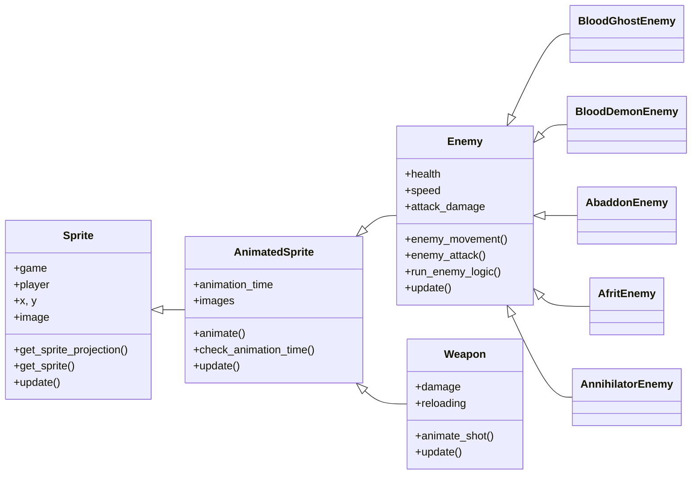
```mermaid
classDiagram
    direction LR
    class Sprite {
        +game
        +player
        +x, y
        +image
        +get_sprite_projection()
        +get_sprite()
        +update()
    }
    class AnimatedSprite {
        +animation_time
        +images
        +animate()
        +check_animation_time()
        +update()
    }
    class Enemy {
        +health
        +speed
        +attack_damage
        +enemy_movement()
        +enemy_attack()
        +run_enemy_logic()
        +update()
    }
    class Weapon {
        +damage
        +reloading
        +animate_shot()
        +update()
    }
    class BloodGhostEnemy
    class BloodDemonEnemy
    class AbaddonEnemy
    class AfritEnemy
    class AnnihilatorEnemy

    Sprite <|-- AnimatedSprite
    AnimatedSprite <|-- Enemy
    AnimatedSprite <|-- Weapon
    Enemy <|-- BloodGhostEnemy
    Enemy <|-- BloodDemonEnemy
    Enemy <|-- AbaddonEnemy
    Enemy <|-- AfritEnemy
    Enemy <|-- AnnihilatorEnemy
```

#### Core Classes and Composition

The `Game` class acts as the central orchestrator, holding instances of all major manager and entity classes. This composition-based approach keeps the main game loop clean and delegates responsibilities to specialized classes.

- **`Game`**: The main application class. It initializes all systems, runs the main game loop, and manages the overall game state.
    - **Composes:**
        - `Player`: Manages the player's state, movement, and actions.
        - `LevelMap`: Loads and holds the data for the game's map layout.
        - `RenderEngine`: Handles the drawing of walls, floors, ceilings, and screen effects.
        - `Raycaster`: Performs the raycasting calculations necessary to create the 3D perspective.
        - `ObjectsManager`: Manages the lifecycle and updates for all sprites and enemies in the world.
        - `Weapon`: Manages the player's weapon, including animations and firing logic.
        - `Chaser`: (Pathfinding logic for enemies).
        - `SoundManager`: Manages loading and playing all audio cues.
        - `HudScreen`: Renders the head-up display (health, ammo, score).

- **`Menu`**: Manages the user interface outside of active gameplay, including the main menu, leaderboard, and credits screens.

- **`Player`**: Represents the player character, handling input for movement and actions, as well as managing health and score.

- **`Sprite`**: The fundamental class for any object that appears in the 3D world but is not a wall. It handles the logic for calculating its position and scale relative to the player.

- **`AnimatedSprite`**: A subclass of `Sprite` that adds support for frame-based animations, making it the base for any dynamic object.

- **`Enemy`**: A subclass of `AnimatedSprite` that introduces game logic for AI behavior, such as pathfinding (`chaser`), attacking, taking damage, and managing its own state (idle, chase, attack).
    - **`BloodGhostEnemy`, `BloodDemonEnemy`, `AbaddonEnemy`, `AfritEnemy`, `AnnihilatorEnemy`**: Specific enemy types that inherit from `Enemy` and are configured with unique stats (health, speed, damage) and animation sets.

- **`Weapon`**: A subclass of `AnimatedSprite` specifically for the player's weapon. It handles the shooting animation and damage properties.

- **Manager/Engine Classes**:
    - `RenderEngine`: Manages textures and draws the final scene.
    - `Raycaster`: Provides the `RenderEngine` with the data on what to draw.
    - `ObjectsManager`: A container that holds and updates all `Sprite`, `AnimatedSprite`, and `Enemy` instances.
    - `SoundManager`: Centralizes all audio playback.
    - `LevelMap`: Provides a structured way to access the level's wall data.
    - `HudScreen`: Manages the rendering of UI elements over the game scene.
    - `Chaser`: Implements the pathfinding algorithm for enemies.


### Enemies design

In this section, the design choices for enemies in the game are outlined, detailing their roles, behaviors, and how they contribute to the gameplay experience. The enemies are designed to enhance the atmosphere of the dungeon and provide challenges for the player through their interactions and combat mechanics.
All enemies are designed to fit the retro, pixelated style of the game, with simple yet distinct sprites that allow players to easily identify different types of enemies and their behaviors. Each enemy type has unique attributes such as health, attack power, and movement patterns that contribute to the overall challenge and variety in combat encounters. The design of the enemies also incorporates elements of the game's lore and setting, creating a cohesive and immersive experience for players as they navigate through the dungeon.

#### Demons Dungeon: Infernal Bestiary

| Demon Name         | Combat Role     | Lore & Description                                                                                                | Attack Power  | Visual Appearance                                                                                      |
|:-------------------|:----------------|:------------------------------------------------------------------------------------------------------------------|:--------------|:-------------------------------------------------------------------------------------------------------|
| **1. Blood Ghost** | Fodder / Shield | Souls tortured until only a physical shell remains. They wander aimlessly but swarm the player to block movement. | **Low**       | Red flying ghosty figure.                                                                              |
| **2. Abaddon**     | Ranged Harasser | The Abaddon is a more powerful and faster variant of the original cacodemon from Doom game.                       | **Medium**    | Medium-ranking ball-like demon covered with horns and has one glowing eye.                             |
| **3. Blood Demon** | Killing machine | A stronger version of Doom's Demon. It has more health, does more damage and has double the health.               | **Medium**    | Big red demon on two legs with grey horns and yellow glowing eyes.                                     |
| **4. Afrit**       | Hitscan         | A decently powerful flying monster with a fireball attack.                                                        | **High**      | A flying red monster with black horns.                                                                 |
| **5. Annihilator** | Boss-Demon      | A general of the hell armies. It commands the arena.                                                              | **Very High** | Standing 10ft tall with deep red skin and massive ram horns. It carries two machine guns in his hands. |


### Sprites and textures design

In this section, the design choices for sprites and textures used in the game are outlined, detailing the visual style, sources of assets, and how they contribute to the overall atmosphere and gameplay experience. The design focuses on creating a cohesive aesthetic that matches the retro, pixelated style inspired by classic Doom game while ensuring clarity and functionality in gameplay.

#### Sprite design

In this section, the design of sprites for the enemies, and other interactive elements is described. The sprites are designed to be simple yet visually distinct to ensure that players can easily identify different entities in the game. The use of a limited color palette and pixel art style contributes to the retro aesthetic.

| Asset Type                         | Description                                                                                | Source                                                              | Notes                                                                                                                       |
|------------------------------------|--------------------------------------------------------------------------------------------|---------------------------------------------------------------------|-----------------------------------------------------------------------------------------------------------------------------|
| Game level ambient sprites         | Static sprites for environmental details (e.g. torches, blood stains)                      | Custom-designed or sourced from free pixel art sprite libraries     | Used to enhance the atmosphere without cluttering the visual space                                                          |
| Game level animated sprites        | Animated sprites for dynamic elements (e.g. flickering torches, moving shadows)            | Custom-designed or sourced from free pixel art sprite libraries     | Should be subtle and placed in the corners and along the walls                                                              |
| Blood Ghost animated sprites       | A set of frames for the Blood Ghost demon, showing idle, walking, and attacking animations | Taken from https://www.realm667.com/repository/beastiary/doom-style | Should be visually distinct and fit the retro theme                                                                         |
| Abbadon Demon animated sprites     | A set of frames for the Abaddon demon, showing idle, walking, and attacking animations     | Taken from https://www.realm667.com/repository/beastiary/doom-style | Should be visually distinct and fit the retro theme                                                                         |
| Blood Demon animated sprites       | A set of frames for the Blood demon, showing idle, walking, and attacking animations       | Taken from https://www.realm667.com/repository/beastiary/doom-style | Should be visually distinct and fit the retro theme                                                                         |
| Afrit Demon animated sprites       | A set of frames for the Afrit demon, showing idle, walking, and attacking animations       | Taken from https://www.realm667.com/repository/beastiary/doom-style | Should be visually distinct and fit the retro theme                                                                         |
| Annihilator Demon animated sprites | A set of frames for the Annihilator demon, showing idle, walking, and attacking animations | Taken from https://www.realm667.com/repository/beastiary/doom-style | Should be visually distinct and fit the retro theme; boss should have a more elaborate sprite set to reflect its importance |

- Blood Ghost Demon front sprite:

[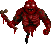](assets/sprites/animated/enemies/blood_ghost/GHSTA1.png)

- Abbadon Demon front sprite:

[](assets/sprites/animated/enemies/abbadon/HED3A1.png)

- Blood Demon front sprite:

[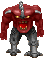](assets/sprites/animated/enemies/blood_demon/SRG2E1.png)

- Afrit Demon front sprite:

[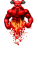](assets/sprites/animated/enemies/afrit/FRITA1.png)

- Annihilator Demon front sprite:

[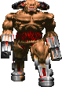](assets/sprites/animated/enemies/annihilator/ANNIA1C1.png)


Player's Weapon:

Sprites for the player's weapon have been taken from this source: https://www.realm667.com/repository/armory/doom-style

Main sprite looks like this:

[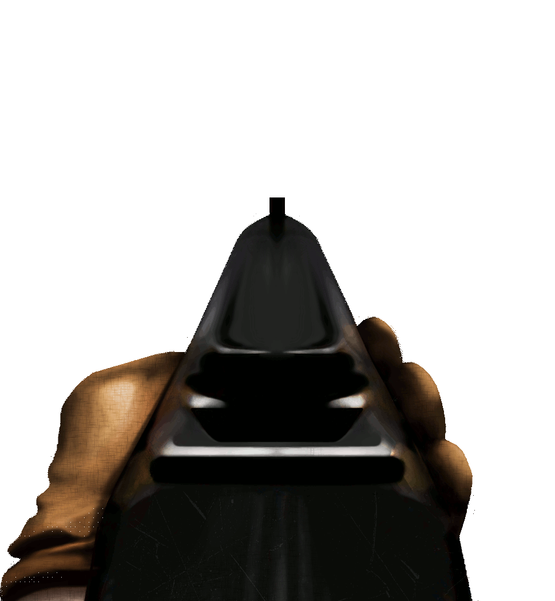](assets/sprites/weapon/shotgun/0.png)


Ambient Objects:

To add various ambient objects to the game level it has been decided to use different types of light sources like torches and candles.
The sprites for them have been taken from this source: https://www.realm667.com/repository/prop-stop/light-sources

- Black Torch:

[](assets/sprites/animated/ambient_objects/black_torch/BTORA0.png)

- Fire Blu Torch:

[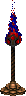](assets/sprites/animated/ambient_objects/fire_blu_torches/TFBTA0.png)

- Blue Stone Torch:

[](assets/sprites/animated/ambient_objects/stone_torch/blue/STFBA0.png)

- Hexen Candles:

[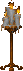](assets/sprites/animated/ambient_objects/more_hexen_candles/SCANA0.png)

- Blue Torch:

[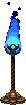](assets/sprites/animated/ambient_objects/improved_torches/blue_torches/TBLUA0.png)

- Green Torch:

[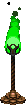](assets/sprites/animated/ambient_objects/improved_torches/green_torches/TGRNA0.png)

- Red Torch:

[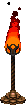](assets/sprites/animated/ambient_objects/improved_torches/red_torches/TREDA0.png)


#### Texture design

In this section, the design of textures for walls, floors, and other environmental elements is described. The textures are created to be low-resolution and pixelated, consistent with the overall visual style of the game. The choice of textures helps to create an immersive dungeon atmosphere.

| Asset Type               | Description                                                         | Source                                                           | Notes                                                                   |
|--------------------------|---------------------------------------------------------------------|------------------------------------------------------------------|-------------------------------------------------------------------------|
| Dungeon wall textures    | Low-res, pixelated textures for walls and corridors                 | Custom-designed or sourced from free pixel art texture libraries | Should be consistent in style and color palette to maintain immersion   |
| Game over texture        | A pixelated "Game Over" graphic to display when the player loses    | Custom-designed using pixel art tools                            | Should be visually striking and fit the retro theme                     |
| Victory texture          | A pixelated "Victory" graphic to display when the player wins       | Custom-designed using pixel art tools                            | Should be celebratory and fit the retro theme                           |
| Dungeon ambient textures | Additional textures for environmental details (e.g. cracks, stains) | Custom-designed using pixel art tools                            | Used to enhance the atmosphere without cluttering the visual space      |
| Dungeon exit texture     | A distinct texture for the exit door                                | Custom-designed to stand out from other textures                 | Should be easily identifiable to guide the player towards the exit      |
| Dungeon ceiling textures | Optional textures for ceilings to add depth to the environment      | Custom-designed or sourced from free pixel art texture libraries | Can be used to enhance the visual variety of the dungeon                |


- Dungeon wall texture 1:

[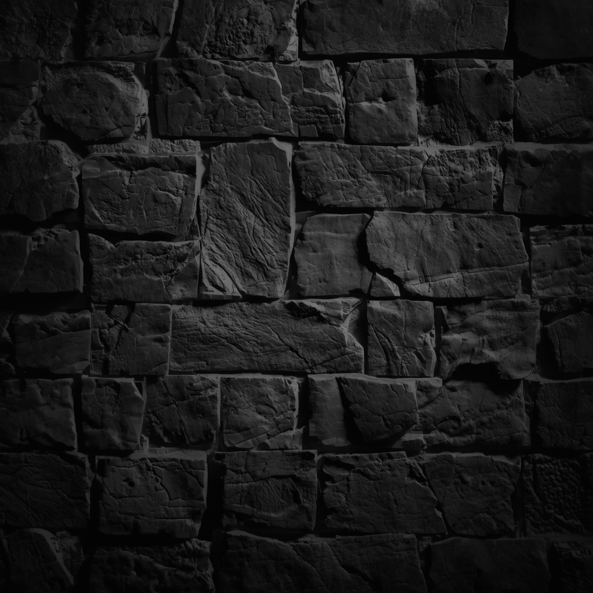](assets/textures/bricks_texture_1.jpg)

- Dungeon wall texture 2:

[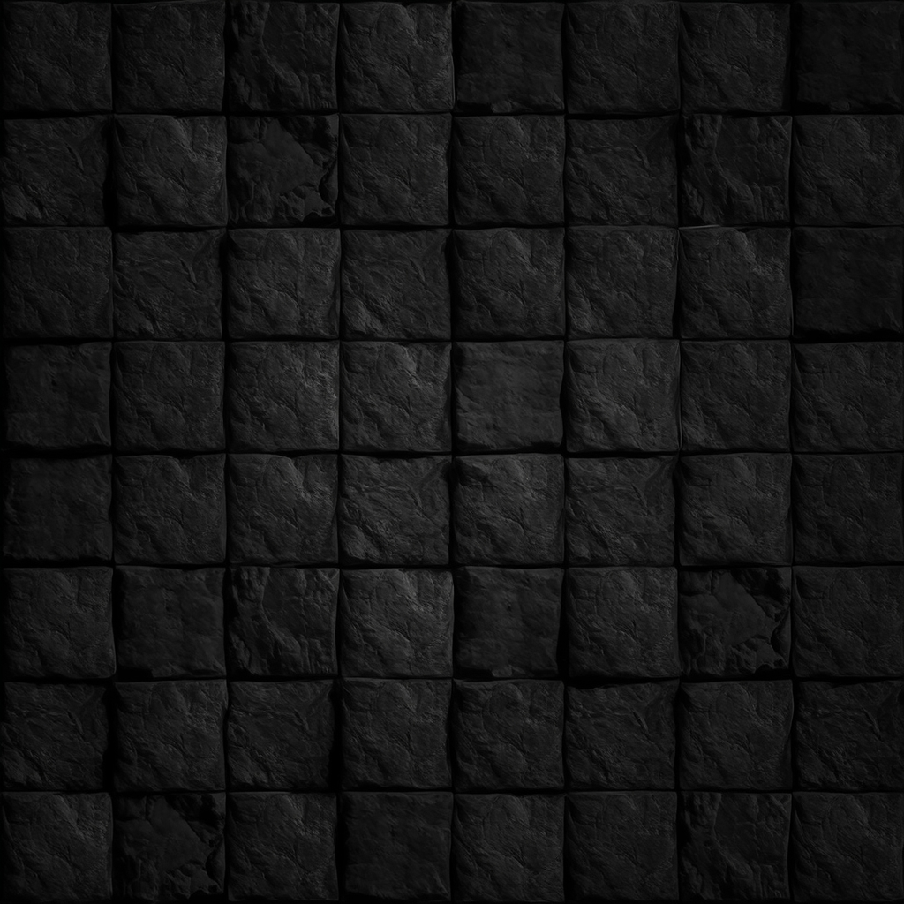](assets/textures/bricks_texture_2.jpg)

- Dungeon wall texture 3:

[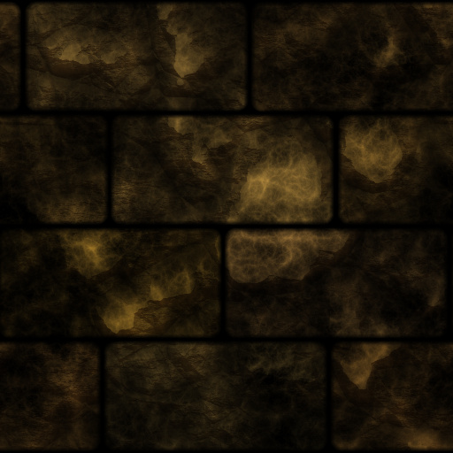](assets/textures/bricks_texture_3.jpg)

- Ambient dungeon wall texture with blood stains 1:

[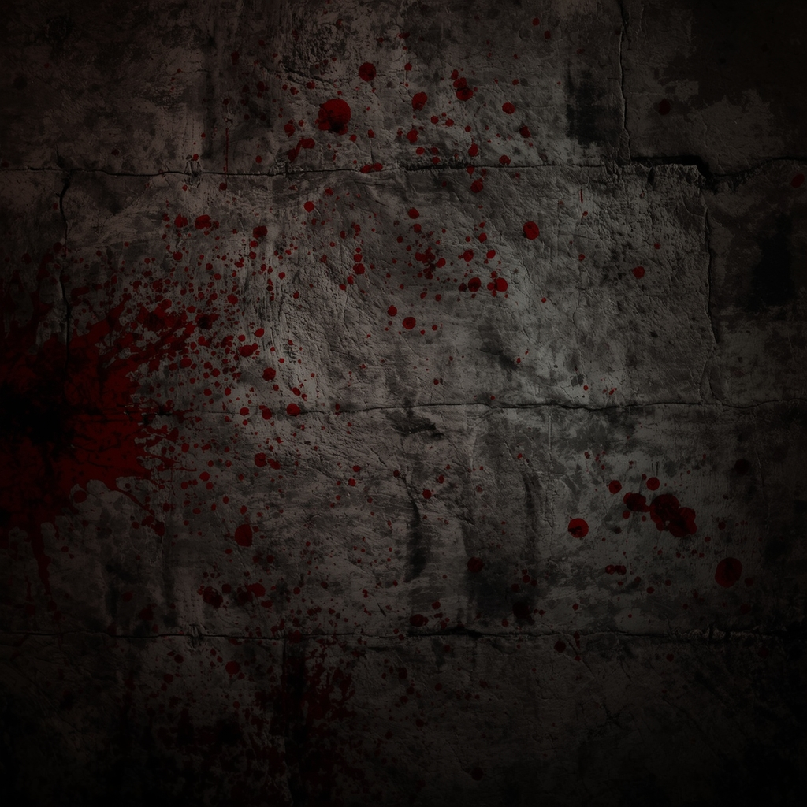](assets/textures/bricks_texture_4.jpg)

- Ambient dungeon wall texture with blood stains 2:

[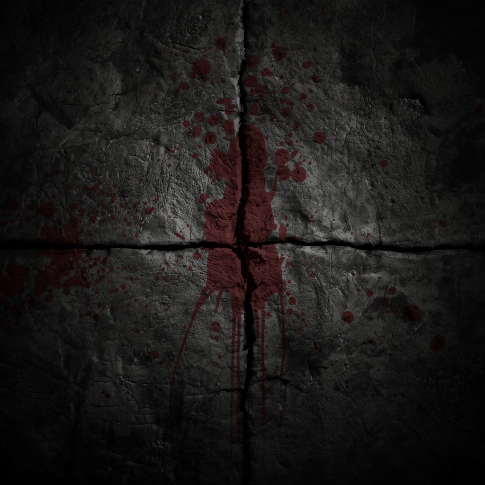](assets/textures/bricks_texture_5.jpg)

- Exit door texture:

[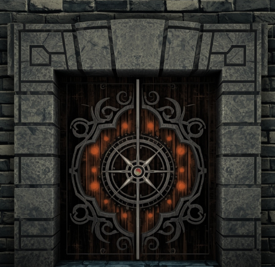](assets/textures/exit_portal_7.png)


### Feedback mechanics design

#### Visual feedback

In this section, the visual feedback mechanics for the game are outlined, detailing how the game will visually communicate important events to the player, such as taking damage, hitting enemies, and defeating the boss. The table below summarizes the key aspects of visual feedback, their purpose, implementation details, and any additional notes.

| Aspect              | Purpose                                                                  | Details                                                                           | Implementation                                                                                                                | Notes                                                                       |
|---------------------|--------------------------------------------------------------------------|-----------------------------------------------------------------------------------|-------------------------------------------------------------------------------------------------------------------------------|-----------------------------------------------------------------------------|
| Player takes damage | Provide a clear, immediate visual cue to the player                      | Screen briefly flashes red to indicate harm, decreased health is updated onto HUD | Overlay a semi-transparent red rectangle on the screen for a short duration after taking damage. Update reduced health on HUD | Flash intensity can be proportional to the amount of damage taken           |
| Enemy hit           | Confirm to the player that their attack was successful                   | Enemy sprite changes to the pain one                                              | Change the enemy sprite to the pain one                                                                                       | Can also include a brief animation (e.g. recoil) for stronger feedback      |
| Enemy death         | Indicate that an enemy has been defeated                                 | Enemy sprite plays a death animation and leaves the corpse after that             | Trigger a death animation sequence and then leave the enemy's corpse on the game level                                        |                                                                             |
| Health regeneration | Show that the player is recovering health over time                      | Important to allow player contiue playing the game and shoot more enemies         | Player's health indicator on HUD increases in value                                                                           |                                                                             |
| Weapon firing       | Provide feedback that the player's attack action has been registered     | Play weapon shooting animation                                                    | Animate a set of sprites when the player fires their weapon                                                                   | Can be enhanced with screen shake for more impact                           |
| Enemy attack        | Alert the player that an enemy is attacking or has detected them         | Enemy sprite changes to attack one                                                | Change the enemy sprite to the attack one and briefly flash red on the screen when the player takes damage                    | Can be used to increase tension and encourage player awareness of their surroundings |


#### Audio feedback

In this section, the audio feedback mechanics for the game are outlined, detailing how the game will use sound effects and music to enhance immersion and provide cues to the player about important events such as taking damage, hitting enemies, and defeating the boss. The table below summarizes the key aspects of audio feedback, their purpose, implementation details, and any additional notes.

| Aspect              | Purpose                                                                | Details                                                                                  | Implementation                                                                                                    | Notes                                                                                               |
|---------------------|------------------------------------------------------------------------|------------------------------------------------------------------------------------------|-------------------------------------------------------------------------------------------------------------------|-----------------------------------------------------------------------------------------------------|
| Player takes damage | Provide an auditory cue that the player has been hit                   | A distinct pain sound effect plays when the player takes damage                          | Play a preloaded pain sound effect from the audio manager when the player's health decreases due to enemy attacks | Sound can vary based on the amount of damage taken (e.g. different sounds for minor vs major hits)  |
| Enemy hit           | Confirm to the player that their attack was successful                 | A distinct hit sound effect plays when an enemy is hit                                   | Play a preloaded hit sound effect when the player's attack successfully hits an enemy                             | Can be enhanced with a brief audio cue for critical hits or headshots                               |
| Enemy death         | Indicate that an enemy has been defeated                               | A death sound effect plays when an enemy is killed                                       | Play a preloaded death sound effect when an enemy's health reaches zero                                           |
| Weapon firing       | Provide feedback that the player's attack action has been registered   | A gunshot sound effect plays when the player shoots                                      | Play a preloaded gunshot sound effect each time the player fires their weapon                                     | Can be enhanced with different sounds for different weapons if implemented                          |
| Enemy attack        | Alert the player that an enemy is attacking or has detected them       | A distinct alert sound plays when an enemy detects the player or initiates an attack     | Play a preloaded alert sound effect when an enemy transitions from patrol to chase or attack state                | Can be used to increase tension and encourage player awareness of their surroundings                |

#### Game state feedback

In this section, the game state feedback mechanics for the game are outlined, detailing how the game will communicate important state changes to the player, such as winning or losing the game. The table below summarizes the key aspects of game state feedback, their purpose, implementation details, and any additional notes.

| Aspect              | Purpose                                                                            | Details                                                                   | Implementation                                                                                                                     | Notes                                                                                                                                                 |
|---------------------|------------------------------------------------------------------------------------|---------------------------------------------------------------------------|------------------------------------------------------------------------------------------------------------------------------------|-------------------------------------------------------------------------------------------------------------------------------------------------------|
| Win condition       | Provide a clear indication that the player has won the game                        | Transition to a victory screen with celebratory visuals         | Load a victory screen with unique graphics when the player defeats the boss demon and reaches the exit door                        | Can also include a summary of the player's performance (e.g. score, time taken) on the victory screen                                                 |
| Lose condition      | Provide a clear indication that the player has lost the game                       | Transition to a game over screen with appropriate visuals        | Load a game over screen with somber graphics when the player's health reaches zero                 | Can also include an option to restart the game or return to the main menu from the game over screen                                                   |
| HUD updates         | Keep the player informed of their current status (health, ammo, score, kill count) | The HUD dynamically updates to reflect changes in health, ammo, and score | Implement a HUD that displays health, ammo count, and score, and ensure it updates in real time as the player's status changes | The HUD design should be clear and unobtrusive to maintain immersion while providing essential information e.g. placed on top of the screen or bottom |
| Enemy state changes | Communicate changes in enemy behavior (e.g. from idle to attack)                   | Enemy sprites change to reflect their current state (idle, chase, attack) | Implement state-based sprite changes for enemies to visually indicate their current behavior and alert the player to potential threats | Can be enhanced with additional visual cues (e.g. flashing red when an enemy is about to attack) to increase player awareness and tension          |
| Player's damage | Provide feedback on the player's health status | The screen briefly flashes red when the player takes damage, and the health indicator on the HUD decreases | Implement a damage feedback system that includes a red flash overlay and updates the health display on the HUD in real time | The intensity of the red flash can be proportional to the amount of damage taken to provide more nuanced feedback to the player |
| Leaderboard | Provide feedback on the player's performance compared to others | After the game ends, the player's score is saved to a leaderboard if it is within the top 10 highest scores, and the leaderboard can be viewed from the main menu | Implement a leaderboard system that saves player scores to a file and allows players to view the top scores from the main menu | The leaderboard can include additional information such as player names, scores, and dates achieved for added engagement |


### Pathfinding design

In this section, the design of the pathfinding system for enemy AI is outlined, detailing how enemies will navigate the game environment to chase the player when they are detected. The pathfinding system is crucial for creating challenging and dynamic enemy behavior, allowing enemies to pursue the player effectively while navigating around obstacles in the dungeon. The design focuses on implementing a breadth-first search (BFS) algorithm for pathfinding, which is suitable for grid-based environments like the one in this game. The BFS algorithm will allow enemies to find the shortest path to the player while avoiding walls and other obstacles, creating a more engaging and realistic gameplay experience.

The `chaser.py` module implements the pathfinding logic for enemies, enabling them to navigate the game world and pursue the player. It uses a Breadth-First Search or BFS algorithm to find the shortest path between an enemy and the player on the game map.

The `Chaser` class is responsible for:
1.  Graph Construction: Converting the 2D tile-based game map into a graph data structure where nodes are walkable tiles and edges connect adjacent tiles.
2.  Pathfinding: Executing a BFS algorithm on this graph to find the shortest path from an enemy's current position (`start`) to the player's position (`goal`).
3.  Next-Step Calculation: Determining the immediate next tile the enemy should move to in order to follow the calculated path.

#### Graph Construction

Before any pathfinding can occur, the level's map must be represented as a graph. This process happens once during the `Chaser` object's initialization.

`__init__(self, game)` and `get_graph(self)`

-   The constructor initializes an empty dictionary `self.graph`.
-   It then calls `self.get_graph()`, which iterates through every tile of the game map (`self.map`).
-   For each tile that is not a wall (i.e., is walkable), it calculates all valid adjacent neighbors using `get_next_nodes()`.
-   The result is an adjacency list stored in `self.graph`, where each key is a tuple `(x, y)` representing a walkable tile, and its value is a list of its walkable neighbors.

```python
# chaser.py

# ...
    def get_graph(self):
        # This method constructs the graph representation of the game map...
        for y, row in enumerate(self.map):
            for x, col in enumerate(row):
                if not col:
                    # For each walkable tile (where col is 0), add it to the graph with its adjacent walkable tiles
                    self.graph[(x, y)] = self.graph.get((x, y), []) + self.get_next_nodes(x, y)

    def get_next_nodes(self, x, y):
        # ... It checks the surrounding tiles based on the defined movement directions (self.ways)
        # and returns a list of valid next positions that are not walls (obstacles).
        return [(x + dx, y + dy) for dx, dy in self.ways if (x + dx, y + dy) not in self.game.map.world_map]
```

#### Breadth-First Search Algorithm

The core of the pathfinding logic is the `breadth_first_search` method. 

`breadth_first_search(self, start, goal, graph)`

This method takes the `start` (enemy's position) and `goal` (player's position) coordinates and explores the graph layer by layer.

**Key Data Structures:**
-   `queue = deque([start])`: A queue is initialized with the starting node. The queue holds the nodes to be visited.
-   `visited = {start: None}`: A dictionary that serves two purposes:
    1.  It keeps track of all nodes that have been visited to avoid cycles and redundant processing.
    2.  It stores the "parent" of each visited node, allowing us to reconstruct the path later. The starting node has no parent (`None`).

**Algorithm Steps:**

1.  The `start` node is added to the `queue`.
2.  The `while queue:` loop continues as long as there are nodes to explore.
3.  Inside the loop, `cur_node = queue.popleft()` retrieves the next node to process.
4.  If `cur_node` is the `goal`, the path has been found, and the loop terminates.
5.  If not the goal, the algorithm retrieves all neighbors of `cur_node` from the `graph`.
6.  For each `next_node` (neighbor):
    -   It checks if the neighbor has **not** been visited (`next_node not in visited`).
    -   Crucially, it also checks that the neighbor is not currently occupied by another enemy (`next_node not in self.game.objects_manager.enemies_positions`). This prevents enemies from clustering or blocking each other.
    -   If both conditions are met, the neighbor is added to the `queue` to be explored later, and its parent is recorded: `visited[next_node] = cur_node`.

The method returns the `visited` dictionary, which contains the complete path history.

```python
# chaser.py

# ...
    def breadth_first_search(self, start, goal, graph):
        # ...
        queue = deque([start])
        visited = {start: None}

        while queue:
            cur_node = queue.popleft()
            if cur_node == goal:
                break
            next_nodes = graph[cur_node]

            for next_node in next_nodes:
                if next_node not in visited and next_node not in self.game.objects_manager.enemies_positions:
                    queue.append(next_node)
                    visited[next_node] = cur_node
        return visited
```

#### Path Reconstruction and Next Step

The BFS algorithm gives us a map of how to get from the goal back to the start, but the enemy only needs the very next step to take.

`find_path(self, start, goal)`

1.  This method first calls `breadth_first_search` to get the `visited` dictionary.
2.  It initializes a `path` list starting with the `goal`.
3.  It then backtracks from the `goal` to the `start` using the `visited` dictionary. The `step` variable is updated with its parent (`visited[step]`) in each iteration until it reaches the `start` node.
4.  The `path` list now contains the full path from goal to start (e.g., `[goal, parent_of_goal, ..., node_before_start, start]`).
5.  The method returns `path[-1]`, which is the last element added before the loop terminated. This element is the tile immediately adjacent to the `start` position—the correct next step for the enemy to take.

```python
# chaser.py

# ...
    def find_path(self, start, goal):
        # ...
        self.visited = self.breadth_first_search(start, goal, self.graph)
        path = [goal]
        step = self.visited.get(goal, start)

        # Construct the path from the goal back to the start
        while step and step != start:
            path.append(step)
            step = self.visited[step]

        # Return the last step in the path
        return path[-1]
```

### Raycaster Algorithm

The `raycaster.py` module is the core of the game's 3D rendering engine. It uses the raycasting technique, famously used in games like *Wolfenstein 3D*, to create a 2.5D perspective from a 2D tile map. In (Zubair, 2024) the ray casting technique is described in details. For the Demons Dungeon the implementation is contained within the `Raycaster` class.

The `Raycaster` class performs the following main functions:

1.  Casting Rays: For each vertical column of the screen, it casts a "ray" from the player's position outwards to determine what it hits.
2.  Calculating Distance: It calculates the distance to the first wall that each ray intersects.
3.  Preparing Render Data: Based on the distance, it calculates how tall the wall slice should appear on the screen and which part of the wall texture to use.
4.  Managing Render Objects: It compiles a list of all wall slices and sprites, sorted by distance, for the `RenderEngine` to draw.

#### The `ray_cast` Method: Core Algorithm

This is the heart of the engine. It iterates through every vertical column of the screen (defined by `NUM_RAYS`) and calculates the necessary data for rendering a wall slice in that column.

Algorithm Steps for a Single Ray

For each ray cast from the player's perspective:

Step 1: Initialization
-   The process starts by calculating the angle of the current ray (`ray_angle`). The first ray begins at the left edge of the player's Field of View (`player.angle - HALF_FOV`), and each subsequent ray's angle is incremented by `DELTA_ANGLE`.
-   The player's position (`ox`, `oy`) and map grid coordinates (`x_map`, `y_map`) are retrieved.

Step 2: Horizontal Grid Intersection
-   The algorithm first checks for intersections with horizontal grid lines.
-   It determines the coordinates of the first horizontal line the ray will cross (`y_hor`) and the direction of stepping (`dy`, either +1 or -1).
-   It calculates the distance to this first intersection (`depth_hor`) and the corresponding x-coordinate (`x_hor`).
-   It then enters a loop, "marching" along the ray from one horizontal grid line to the next, incrementing the depth and coordinates at each step (`depth_hor += delta_depth`).
-   In each step, it checks if the current tile `(int(x_hor), int(y_hor))` is a wall in the `world_map`. If a wall is found, the loop breaks, and the final `depth_hor` and the wall's texture ID are stored.

```python
# raycaster.py (Horizontal Intersection Logic)

# ...
y_hor, dy = (y_map + 1, 1) if sin_a > 0 else (y_map - 1e-6, -1)

depth_hor = (y_hor - oy) / sin_a
x_hor = ox + depth_hor * cos_a

delta_depth = dy / sin_a
dx = delta_depth * cos_a

for i in range(MAX_DEPTH):
    tile_hor = int(x_hor), int(y_hor)
    if tile_hor in self.game.map.world_map:
        texture_hor = self.game.map.world_map[tile_hor]
        break
    x_hor += dx
    y_hor += dy
    depth_hor += delta_depth
```

Step 3: Vertical Grid Intersection
-   The same process is repeated for vertical grid lines.
-   The algorithm calculates the first intersection with a vertical line (`x_vert`, `depth_vert`) and then marches along the ray until a wall is hit. The final `depth_vert` and texture ID are stored.

Step 4: Determine the Closest Wall
-   The algorithm compares `depth_hor` and `depth_vert`. The shorter distance is the actual distance to the nearest wall along that ray's path.
-   The `depth`, `texture`, and texture `offset` (the exact point on the wall the ray hit, used for texture mapping) are set based on the closer intersection.

```python
# raycaster.py (Choosing the closer intersection)

if depth_vert < depth_hor:
    depth, texture = depth_vert, texture_vert
    y_vert %= 1
    offset = y_vert if cos_a > 0 else (1 - y_vert)
else:
    depth, texture = depth_hor, texture_hor
    x_hor %= 1
    offset = (1 - x_hor) if sin_a > 0 else x_hor
```

Step 5: Fish-Eye Correction
-   A common issue in simple raycasters is the "fish-eye" effect, where walls appear curved. This is corrected by multiplying the calculated `depth` by the cosine of the angle between the ray and the player's direct line of sight. This gives the true perpendicular distance.

```python
# raycaster.py (Fish-eye correction)

depth *= math.cos(self.game.player.angle - ray_angle)
```

Step 6: Calculate Projected Height
-   The perceived height of the wall slice on the screen (`proj_height`) is inversely proportional to its corrected distance. The formula `SCREEN_DIST / (depth + 0.0001)` is used, where `SCREEN_DIST` is a constant that scales the projection. A small epsilon prevents division by zero.

Step 7: Store the Result
-   The final calculated values for the ray—`(depth, proj_height, texture, offset)`—are appended to the `self.ray_casting_result` list.

This entire process is repeated for every ray (i.e., every vertical screen column).

#### The `get_objects_to_render` Method

After `ray_cast()` has populated `ray_casting_result`, this method translates that raw data into drawable objects for the `RenderEngine`.

-   It iterates through the `ray_casting_result` list.
-   For each result, it uses the `texture` ID to get the correct wall texture image from `self.textures`.
-   Using the `offset`, it extracts the correct vertical slice (a `SCALE`-pixel-wide column) of the texture.
-   It then scales this `wall_column` to the calculated `proj_height`. If the projected height is taller than the screen, the texture is clipped and scaled to prevent distortion.
-   Finally, it calculates the `wall_pos` (the `(x, y)` coordinate to draw the slice on the screen) and appends a tuple `(depth, wall_column, wall_pos)` to the `self.objects_to_render` list.

#### The `update` Method

The `update` method is a simple orchestrator called once per game loop. It ensures the entire process runs in the correct order:
1.  `self.ray_cast()`: Performs all the raycasting calculations based on the player's current position and angle.
2.  `self.get_objects_to_render()`: Processes the results of the raycast to prepare the final list of drawable wall slices.

After `update()` completes, the `RenderEngine` can retrieve this list (along with sprites) and draw the final scene.


### Player Collision Detection Algorithm

The collision detection system in `player.py` is designed to prevent the player from moving through walls. It uses a simple method that checks the player's intended movement against the game's world map before updating their position.

The collision logic is handled by two key methods within the `Player` class:

1.  `check_wall(self, x, y)`: A helper method that determines if a specific grid coordinate `(x, y)` is a solid wall.
2.  `check_wall_collision(self, dx, dy)`: The main method that uses `check_wall` to validate the player's next move and updates the player's position only if the path is clear.

This system works by checking horizontal and vertical movements independently, which helps prevent the player from getting stuck on corners.

#### `check_wall(self, x, y)` Method

This method is the fundamental building block of the collision system. Its sole responsibility is to answer the question: "Is the tile at map coordinate `(x, y)` a wall?"

How It Works

-   It takes an integer `x` and `y` coordinate as input.
-   It checks if the tuple `(x, y)` exists as a key in the game's world map dictionary, which is accessed via `self.game.map.get_world_map()`.
-   The world map dictionary only contains entries for tiles that are walls.
-   Therefore, the expression `(x, y) not in self.game.map.get_world_map()` returns:
    -   `True` if the tile is **not** a wall (i.e., it's open space).
    -   `False` if the tile **is** a wall.

```python
# player.py

def check_wall(self, x, y):
    '''
        This method checks if the player is colliding with a wall at the given coordinates (x, y).
        ...
    '''
    return (x, y) not in self.game.map.get_world_map()
```

#### `check_wall_collision(self, dx, dy)` Method

This method is called by the `movement` method every frame. It takes the proposed movement vector (`dx`, `dy`) for the current frame and decides whether to apply it to the player's position.

Algorithm Steps

1.  Calculate Scale: It first calculates a `scale` factor based on `PLAYER_SIZE_SCALE` and `self.game.delta_time`. This is used to project the player's position slightly ahead for the collision check.

2.  Check Horizontal Movement:
    -   It calculates the player's potential next horizontal position: `int(self.x + dx * scale)`.
    -   It calls `self.check_wall()` with this new x-coordinate and the player's *current* y-coordinate.
    -   If `check_wall()` returns `True` (meaning the path is clear), it updates the player's horizontal position: `self.x += dx`. If it returns `False`, the horizontal movement is blocked, and `self.x` is not changed.

3.  Check Vertical Movement:
    -   It then performs a separate check for the vertical movement. It calculates the potential next vertical position: `int(self.y + dy * scale)`.
    -   It calls `self.check_wall()` with the player's *current* x-coordinate and this new y-coordinate.
    -   If `check_wall()` returns `True`, it updates the player's vertical position: `self.y += dy`. Otherwise, the vertical movement is blocked.

By checking the axes independently, the player can slide along a wall. For example, if moving diagonally towards a wall and the horizontal movement is blocked, the vertical component of the movement can still be applied, resulting in smooth "wall sliding" behavior.

```python
# player.py

def check_wall_collision(self, dx, dy):
    '''
        This method checks for wall collisions based on the player's movement...
        ...
    '''
    scale = PLAYER_SIZE_SCALE / self.game.delta_time
    # Check horizontal movement
    if self.check_wall(int(self.x + dx * scale), int(self.y)):
        self.x += dx
    # Check vertical movement
    if self.check_wall(int(self.x), int(self.y + dy * scale)):
        self.y += dy
```


### Sprites Animation

The `animated_sprite.py` module provides the functionality for creating and rendering sprites that have frame-by-frame animations. It builds upon the base `Sprite` class and adds a time-based animation system.

The `AnimatedSprite` class is responsible for:

1.  Loading Image Sequences: Automatically loading all image files from a specified directory to serve as animation frames.
2.  Managing Animation State: Storing these frames in an efficient data structure (`collections.deque`).
3.  Controlling Animation Speed: Using a timer to control the playback speed of the animation, ensuring it is independent of the game's frame rate.
4.  Updating the Current Frame: Cycling through the image sequence to create the illusion of movement.

#### Initialization (`__init__`)

When an `AnimatedSprite` is created, its constructor sets up everything needed for the animation.

-   It calls the parent `Sprite` constructor (`super().__init__(...)`) to handle basic properties like position and scale.
-   `self.animation_time`: Stores the duration (in milliseconds) that each frame should be displayed.
-   `self.path`: The directory path containing the animation frames is extracted from the input `path`.
-   `self.images`: The `get_images(self.path)` method is called to load all image files from the directory. The loaded images are stored in a `deque`. A `deque` (double-ended queue) is used because it provides a highly efficient `.rotate()` method, which is perfect for cycling through animation frames.
-   `self.animation_time_prev`: This is initialized with the current time (`pg.time.get_ticks()`). It acts as a timestamp for the last frame change.
-   `self.animation_trigger`: A boolean flag, initially `False`, that signals when it's time to advance to the next frame.

```python
# animated_sprite.py

def __init__(self, game, path='...', animation_time=120):
    super().__init__(game, path, pos, scale, shift)
    self.animation_time = animation_time
    self.path = path.rsplit('/', 1)[0]
    self.images = self.get_images(self.path)
    self.animation_time_prev = pg.time.get_ticks()
    self.animation_trigger = False
```

#### The Animation Loop

The animation logic is driven by the `update` method, which is called once per game loop.

`update(self)`

This method orchestrates the animation process in a specific order:
1.  `super().update()`: It first calls the parent `Sprite.update()` method. This is crucial as it handles the sprite's positioning and projection calculations relative to the player.
2.  `self.check_animation_time()`: It then checks if enough time has passed to switch to the next frame.
3.  `self.animate(self.images)`: Finally, if the animation was triggered, it updates the sprite's current image.

`check_animation_time(self)`

This method acts as the animation's timer.
-   It gets the current time (`time_now`).
-   It calculates the elapsed time since the last frame change: `time_now - self.animation_time_prev`.
-   If this elapsed time is greater than `self.animation_time`, it means the current frame's display duration is over.
-   It then resets the timer by updating `self.animation_time_prev = time_now` and sets `self.animation_trigger = True`.

```python
# animated_sprite.py

def check_animation_time(self):
    self.animation_trigger = False
    time_now = pg.time.get_ticks()
    if time_now - self.animation_time_prev > self.animation_time:
        self.animation_time_prev = time_now
        self.animation_trigger = True
```

`animate(self, images)`

This method performs the actual frame switch.
-   It checks if `self.animation_trigger` is `True`.
-   If it is, it calls `images.rotate(-1)`. This is the core of the animation cycle. It efficiently moves the first element of the `deque` to the end.
-   After rotating, the new first element of the `deque` (`images[0]`) becomes the current frame, so `self.image` is updated to this new frame.

```python
# animated_sprite.py

def animate(self, images):
    if self.animation_trigger:
        images.rotate(-1)
        self.image = images[0]
```

#### Image Loading

`get_images(self, path)`

This utility method handles the loading of animation frames from a folder.
-   It initializes an empty `deque`.
-   It uses `os.listdir(path)` to get a list of all filenames in the specified directory.
-   It iterates through each `file_name`, loading it as a Pygame image using `pg.image.load()`. The `.convert_alpha()` call is important for preserving transparency.
-   Each loaded image is appended to the `deque`.
-   The fully populated `deque` of images is returned.

`get_event_images(self, path, suffixes, prefix)`

This is a more specialized version of `get_images`. Instead of loading all files in a directory, it constructs filenames based on a `prefix` and a list of `suffixes`. This is used by the `Enemy` class to load specific animation sequences (e.g., attack, pain, death) from a shared set of sprite sheets where filenames follow a consistent pattern.


---

## Regular backlog reviews and development review meetings

In this section evidence of regular backlog reviews, a maintained burndown chart and development review meetings are documented.

### Backlog review, burndown chart and development review meeting on 18.02.2026 for the accomplished Sprint 1

The Sprint 1 has finished on 17.02.2026 and the backlog review and sprint review meeting have been conducted on 18.02.2026. 
During the backlog review, the progress made during Sprint 1 has been assessed.
From backlog point of view Epic 1 with all three user stories US 1.1, US 1.2, US 1.3 has been fully completed.
Moreover, Epic 2 with its user story US 2.1 has been completed as well despite it has been planned for Sprint 2.

The burndown chart for Sprint 1 is shown below, indicating the progress made in completing the tasks and user stories planned for the sprint 1 from the scrum backlog.

[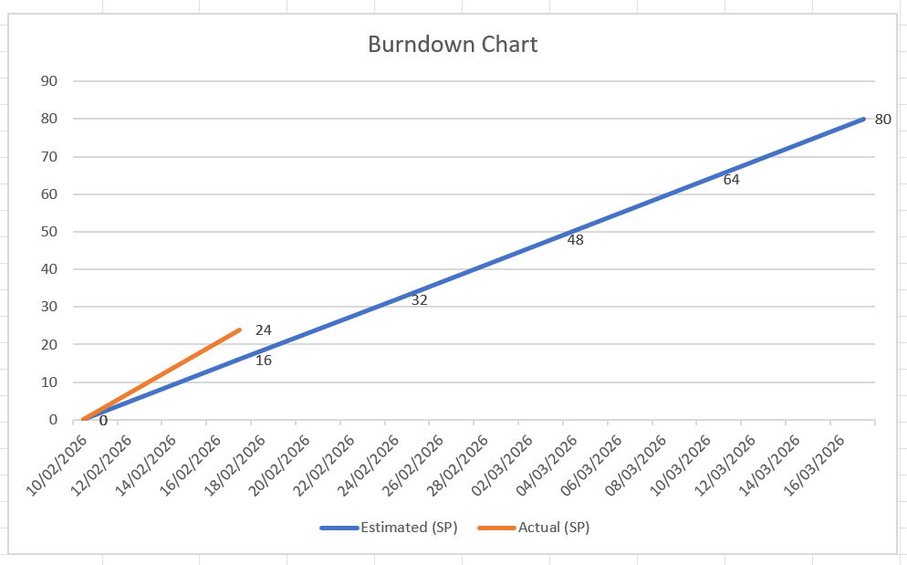](images/doc/burndown_chart_sprint_1.png)

From the development review point of view the following has been accomplished during Sprint 1:

*Design:*
- Produced design contract.
- Defined development strategies.
- Produced game story, characters and motivation loop.
- Captured environment, levels and artwork descriptions.
- Designed game level and gameplay systems and rules.
- Designed game and motivation loops.
- Captured UI and controls.
- Defined programming language and platform.
- Designed state diagrams for player and enemy AI.
- Designed 7 classes for the game.
- Described enemies and their behaviors.
- Described sprites and textures for the game.
- Designed game level.
- Designed visual, audio and game state feedback mechanics.

*Coding:*
- Created game menu with options for entering player name, starting a new game, viewing the leaderboard, viewing game credits and exiting the game.
- Set up the main game loop and input handling.
- Implemented basic player movement and collision detection.
- Implemented a simple raycasting renderer to display the environment.
- Created a game level map and loaded it into the game.
- Created several textures for walls and also a texture for the exit door.
- Implemented background music to play Doom theme mp3 during gameplay.

*Testing:*
- Tested player movement and collision detection to ensure smooth navigation through the environment.
- Tested raycasting renderer to ensure correct rendering of walls and textures.
- Tested game level loading to ensure the map is correctly represented in the game.
- Tested background music playback to ensure it plays correctly during gameplay.
- Tested main game menu functionality to ensure all options work as intended (e.g. starting a new game, viewing leaderboard, etc.).
- Tested main game loop to ensure it runs smoothly without crashes or major bugs during gameplay.

*Blockers:*

No blockers have been encountered during Sprint 1. All planned tasks and user stories have been completed successfully, and the development process has proceeded as expected without any major issues or obstacles.

*Plan for the next sprint:*

For the next sprint, the focus will be on implementing Epic 3 - "Enemy AI & basic combat" and Epic 4 - "HUD, health, and scoring" following the outlined incremental design and sprint planning result. This will involve coding the mechanics for the player's weapon (shotgun), implementing the first enemy type (Blood Ghost demon) with basic attack and interaction mechanics, and creating a simple HUD to display player health, ammo, score and kill count.


### Backlog review, burndown chart and development review meeting on 26.02.2026 for the accomplished Sprint 2

The Sprint 2 has finished on 25.02.2026 and the backlog review and sprint review meeting have been conducted on 26.02.2026. 
During the backlog review, the progress made during Sprint 2 has been assessed.
From backlog point of view Epic 3 and Epic 4 have been fully completed.

The burndown chart for Sprint 2 is shown below, indicating the progress made in completing the tasks and user stories planned for the sprint 2 from the scrum backlog.

[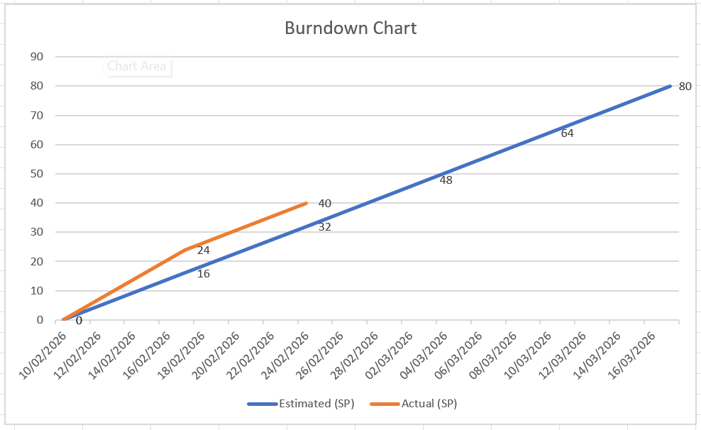](images/doc/burndown_chart_sprint_2.png)

From the development review point of view the following has been accomplished during Sprint 2:

*Design:*
- Designed shotgun weapon mechanics including firing, ammo management and animation.
- Design HUD elements to display player health, ammo, score and kill count.
- Designed Blood Ghost demon with basic attack and interaction mechanics with the player (dealing damage to player and taking damage from player).
- Designed player health mechanics to reduce health when hit by demon.
- Designed score and kill count mechanics to increment when an enemy is killed.


*Coding:*
- Coded shotgun rendering.
- Coded shotgun firing mechanics with ammo management so that shotgun is animated when firing event happens and ammo count is decreased.
- Coded a simple HUD to display player health, ammo, score and kill count.
- Coded Blood Ghost demon with basic attack and implemented its interaction with the player (dealing damage to player when within the attack range and taking damage from player when hit).
- Coded player health mechanics to reduce health when hit by demon.
- Coded score and kill count increment when an enemy is killed.


*Testing:*
- Tested HUD to show score, ammo, kill count, health and their updates in real time.
- Tested weapon firing mechanics to ensure the player can shoot and hit enemies correctly.
- Tested weapon animation to ensure the shotgun firing animation plays correctly when the player shoots.
- Tested player health mechanics to ensure the player takes damage correctly when hit by demon.
- Tested enemies kill count and score increment correctly when an enemy is killed.
- Tested first demon (Blood Ghost) implementation to ensure it is rendered and interacts correctly with the player (taking damage, dealing damage).

*Blockers:*

One blocker has been encountered during Sprint 2. When the work to integrate first demon into the game commenced it was challenging to understand which sprites correspond to which animation frames and how to implement the animation system for the enemy. 
However, after some research and experimentation, the issue was resolved by creating a simple animation manager that cycles through the appropriate frames based on the enemy's state (idle, walking, attacking) and correct mapping of sprites to demon's actions has been established.
All other planned tasks and user stories have been completed successfully, and the development process has proceeded as expected without any major issues or obstacles.

*Plan for the next sprint:*

For the next sprint, the focus will be on:
- Epic 3: implementing three more demons Blood Demon, Abaddon, Afrit.
- Epic 3: implementing boss demon Annihilator with higher difficulty than other demons.
- Epic 5: implementing sound effects for player actions and enemy interactions (e.g. player pain sounds, enemy hit and death sounds, boss defeat sound).
- Epic 6: implement game over and victory conditions and screens (e.g. transition to game over screen when player health reaches zero, transition to victory screen when boss is defeated and exit door is reached).


### Backlog review, burndown chart and development review meeting on 05.03.2026 for the accomplished Sprint 3

The Sprint 3 has finished on 04.03.2026 and the backlog review and sprint review meeting have been conducted on 05.03.2026. 
During the backlog review, the progress made during Sprint 3 has been assessed.
From backlog point of view Epic 3, 5 and 6 have been fully completed.

The burndown chart for Sprint 3 is shown below, indicating the progress made in completing the tasks and user stories planned for the sprint 3 from the scrum backlog.

[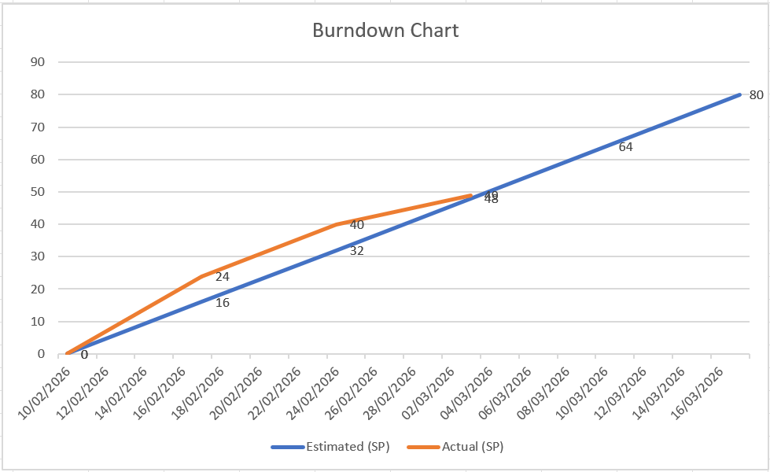](images/doc/burndown_chart_sprint_3.png)

From the development review point of view the following has been accomplished during Sprint 3:
*Design:*
- Design game flow and win/lose conditions so that the game transitions to victory screen when boss is defeated and exit door is reached and to game over screen when player health reaches zero.
- Design game over screen that is displayed when the player's health reaches zero, allowing the player to restart the game or return to the main menu.
- Design exit door at the end of the game level.
- Design victory screen that is displayed when the player defeats the boss demon and reaches the exit door, signaling the player's victory and providing an option to restart the game or return to the main menu.

Game Over screen:

[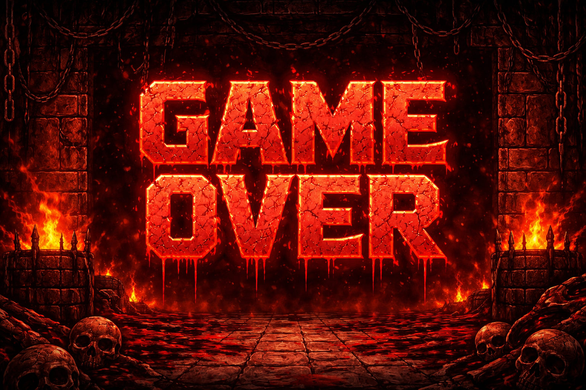](assets/textures/game_over_screen_texture.png)

Game Victory screen:

[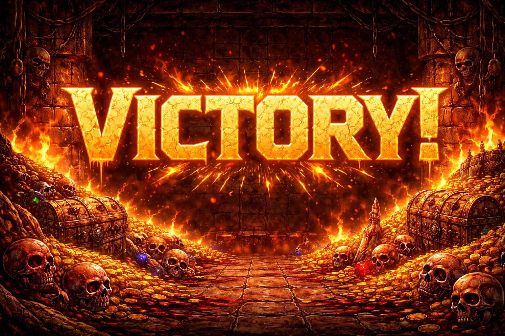](assets/textures/game_won_screen_texture.png)

*Coding:*
- Coded three more demons so that they are animated correctly for different events like idle, walk, attack, pain and have their own attributes (health, damage).
- Coded simple 'AI' for demons so that they chase player when player is seen and attack when player is in range.
- Placed demons in the game level.
- Adjusted demon attributes (health, damage) to ensure a balanced and challenging gameplay experience.
- Implemented boss demon Annihilator with higher difficulty than other demons.
- Implemented sound effects for player actions and enemy interactions (e.g. player pain sounds, enemy hit and death sounds, boss defeat sound).
- Coded game over screen that is displayed when the player's health reaches zero, allowing the player to restart the game or return to the main menu.
- Coded game over logic to transition to the game over screen when player's health reaches zero.
- Coded victory screen that is displayed when the player defeats the boss demon and reaches the exit door, signaling the player's victory and returning to the main menu.
- Coded victory logic to transition to the victory screen when boss is defeated and exit door is reached.
- Coded the exit door on the game level.


*Testing:*
- Test each demon's animation to ensure they are rendered correctly for different events like idle, walk, attack, pain and that their attributes (health, damage) are working as intended.
- Test demon 'AI' to ensure they chase player when player is seen and attack when player is in range.
- Test combat mechanics with demons to ensure they interact correctly with the player (dealing damage to player and taking damage from player).
- Test sound effects to ensure they play correctly for player actions and enemy interactions.
- Tested exit door to ensure it is visible on the game level.
- Tested game over screen to ensure it is displayed correctly when the player's health reaches zero and that the return to the main menu work as intended.
- Tested game over logic to ensure the game transitions to the game over screen when player's health reaches zero.
- Tested victory screen to ensure it is displayed correctly when the player defeats the boss demon and reaches the exit door, and that the return to the main menu works as intended.
- Tested game victory logic to ensure the game transitions to the victory screen when boss is defeated and exit door is reached.


*Blockers:*

No major blockers have been encountered during Sprint 3.
All other planned tasks and user stories have been completed successfully, and the development process has proceeded as expected without any major issues or obstacles.

*Plan for the next sprint:*

For the next sprint, the focus will be on:
- Epic 7: implementing three more demons Blood Demon, Abaddon, Afrit.
- Epic 8: implement 'AI' for demons so that they chase player when player is seen and attack when player is in range.


### Backlog review, burndown chart and development review meeting on 11.03.2026 for the accomplished Sprint 4

The Sprint 4 has finished on 11.03.2026 and the backlog review and sprint review meeting have been conducted on 11.03.2026. 
During the backlog review, the progress made during Sprint 4 has been assessed.
From backlog point of view Epic 7, 8 and 9 have been fully completed. 
The epic 9 wasn't planned for the sprint 4, but it has been completed as well as it was possible to complete it in the same sprint.

The burndown chart for Sprint 4 is shown below, indicating the progress made in completing the tasks and user stories planned for the sprint 4 from the scrum backlog.
As it can be seen thanks to epic 9 also done in sprint 4 the actual number of story points completed is higher than the planned one for the sprint 4.

[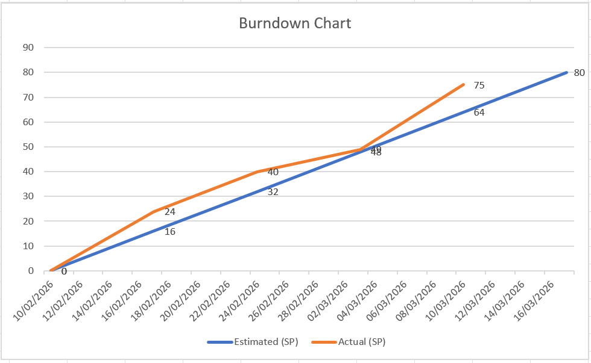](images/doc/burndown_chart_sprint_4.png)

From the development review point of view the following has been accomplished during Sprint 4:

*Design:*
- Design layout of the ambient objects in the game level to enhance the visual experience and create a more immersive environment. Ambient objects such as torches and candles are placed strategically around the game level, particularly in corners and along walls, to add visual interest and atmosphere without cluttering the player's view or hindering gameplay.
- Design health regeneration mechanics so that player's health regenerates over time when not taking damage.


*Coding:*
- Coded layout of the ambient objects in the game level.
- Coded health regeneration mechanics so that player's health regenerates over time when not taking damage.


*Testing:*
- Tested layout of the ambient objects in the game level to ensure they are rendered correctly and enhance the visual experience.
- Tested health regeneration mechanics to ensure player's health regenerates over time when not taking damage and that it does not regenerate when the player is taking damage.

*Blockers:*

No major blockers have been encountered during Sprint 4. 

*Plan for the next sprint:*

For the last sprint 5, the focus will be on epic 10: 
- Testing the game thoroughly and bug fixing: address any remaining bugs and optimize performance.
- Test FPS to ensure the game runs smoothly and demonstrates 60 FPS.
- Test final AI and combat mechanics to ensure they are working as intended and provide a fun and challenging gameplay experience.
- Testing overall game balance to ensure the game is enjoyable and provides a good level of challenge without being too difficult or too easy.
- Finish the documentation: ensure all design and development documentation is complete and up to date as per the assignment requirements.

---

## Testing


In this section, test cases are defined and executed to verify the functionality of the game based on the user and system requirements.
The test cases cover various aspects of the game, including player movement, combat mechanics, enemy behavior, health system, win/lose conditions, rendering, HUD updates, audio feedback, and performance. 
Each test case includes a unique ID, attribution to an epic and/or user story, a description of the test, preconditions that must be met before executing the test, the expected outcome to determine if the test passes or fails and the actual outcome of the test together with pass or fail outcome.


| EPIC/US     | Test Case ID | Description                                                                         | Precondition                                                                                                                                                                                                                                                                                                                                      | Expected Outcome                                                                                                                                                                                                                                                                                                                                                                | Actual result                                                                                                                                                                                                                                                                                                                                            | Evidence                                                                                                                                                                                                                                                                           | Passed? |
|-------------|--------------|-------------------------------------------------------------------------------------|---------------------------------------------------------------------------------------------------------------------------------------------------------------------------------------------------------------------------------------------------------------------------------------------------------------------------------------------------|---------------------------------------------------------------------------------------------------------------------------------------------------------------------------------------------------------------------------------------------------------------------------------------------------------------------------------------------------------------------------------|----------------------------------------------------------------------------------------------------------------------------------------------------------------------------------------------------------------------------------------------------------------------------------------------------------------------------------------------------------|------------------------------------------------------------------------------------------------------------------------------------------------------------------------------------------------------------------------------------------------------------------------------------|---------|
| EPIC1/US1.1 | TC-01        | Verify player can move with WASD                                                    | Game started                                                                                                                                                                                                                                                                                                                                      | When the player clicks the “A” control, they should be able to move to the left.                                                                                                                                                                                                                                                                                                | When the player clicks the “A” control, they are able to move to the left.                                                                                                                                                                                                                                                                               | [](images/test_evidence/epic_1/a_wasd_key_movement.mp4)                                                                                                                                               | YES     |
| EPIC1/US1.1 | TC-02        | Verify player can move with WASD                                                    | Game started                                                                                                                                                                                                                                                                                                                                      | When the player clicks the “D” control, they should be able to move to the right.                                                                                                                                                                                                                                                                                               | When the player clicks the “D” control, they are able to move to the right.                                                                                                                                                                                                                                                                              | [](images/test_evidence/epic_1/d_wasd_key_movement.mp4)                                                                                                                                               | YES     |
| EPIC1/US1.1 | TC-03        | Verify player can move with WASD                                                    | Game started                                                                                                                                                                                                                                                                                                                                      | When the player clicks the “W” control, they should be able to move forward.                                                                                                                                                                                                                                                                                                    | When the player clicks the “W” control, they are able to move forward.                                                                                                                                                                                                                                                                                   | [](images/test_evidence/epic_1/w_wasd_key_movement.mp4)                                                                                                                                               | YES     |
| EPIC1/US1.1 | TC-04        | Verify player can move with WASD                                                    | Game started                                                                                                                                                                                                                                                                                                                                      | When the player clicks the “S” control, they should be able to move backward.                                                                                                                                                                                                                                                                                                   | When the player clicks the “S” control, they are able to move backward.                                                                                                                                                                                                                                                                                  | [](images/test_evidence/epic_1/s_wasd_key_movement.mp4)                                                                                                                                               | YES     |
| EPIC1/US1.1 | TC-05        | Verify player can move with mouse control                                           | Game started                                                                                                                                                                                                                                                                                                                                      | When the player uses the mouse, they should be able to control which direction they are facing when moving                                                                                                                                                                                                                                                                      | When the player uses the mouse, they are able to control which direction they are facing when moving                                                                                                                                                                                                                                                     | [](images/test_evidence/epic_1/mouse_control_movement.mp4)                                                                                                                                         | YES     |
| EPIC1/US1.2 | TC-06        | Verify player cannot walk through walls                                             | Game started                                                                                                                                                                                                                                                                                                                                      | Player attempts to move into a wall tile.                                                                                                                                                                                                                                                                                                                                       | Player is blocked and cannot move through the wall.                                                                                                                                                                                                                                                                                                      | [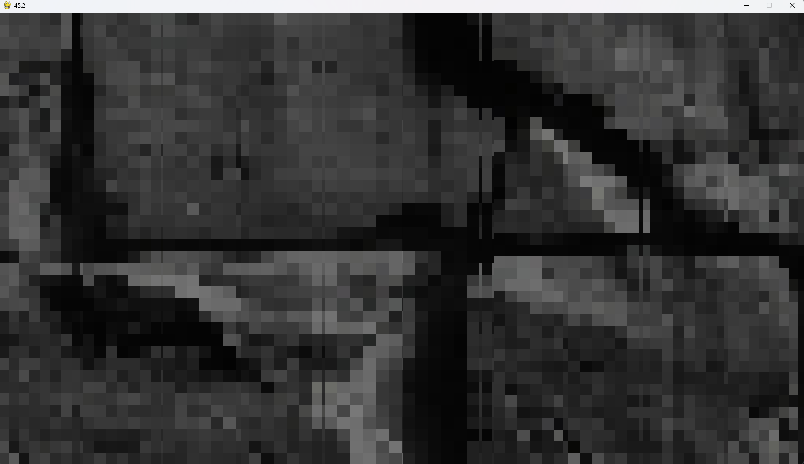](images/test_evidence/epic_1/collision_detection.png)                                                                                                                                               | YES     |
| EPIC1/US1.3 | TC-07        | Verify game menu functionality                                                      | Game launched                                                                                                                                                                                                                                                                                                                                     | Main menu appears with options: player name, new game, leaderboard, game credits, quit game.                                                                                                                                                                                                                                                                                    | Main menu appears with options: player name, new game, leaderboard, game credits, quit game.                                                                                                                                                                                                                                                             | [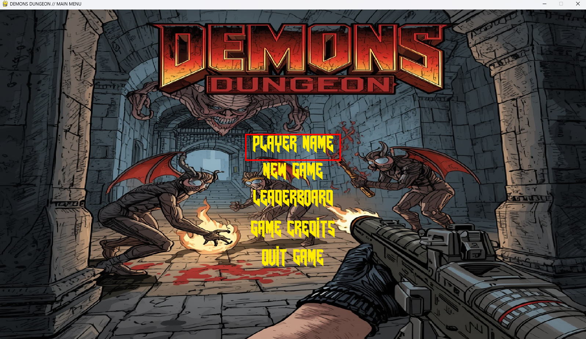](images/test_evidence/epic_1/main_menu.png)                                                                                                                                                                   | YES     |
| EPIC1/US1.3 | TC-08        | Verify menu navigation                                                              | Main menu displayed. Player clicks “PLAYER NAME” button.                                                                                                                                                                                                                                                                                          | Game transitions from menu to player name screen.                                                                                                                                                                                                                                                                                                                               | When the user clicks on the "PLAYER NAME" button, they are transferred to the player name screen where they can enter and save their player name.                                                                                                                                                                                                        | [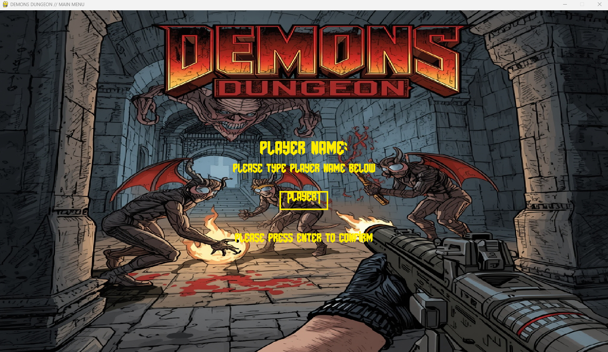](images/test_evidence/epic_1/menu_player_name_screen.png)                                                                                                                                       | YES     |
| EPIC1/US1.3 | TC-09        | Verify menu navigation                                                              | Main menu displayed. Player clicks “NEW GAME” button.                                                                                                                                                                                                                                                                                             | Game transitions from menu to new game.                                                                                                                                                                                                                                                                                                                                         | When the user clicks on the "NEW GAME" button, they are transferred into the game onto the game level where the user can begin the game.                                                                                                                                                                                                                 | [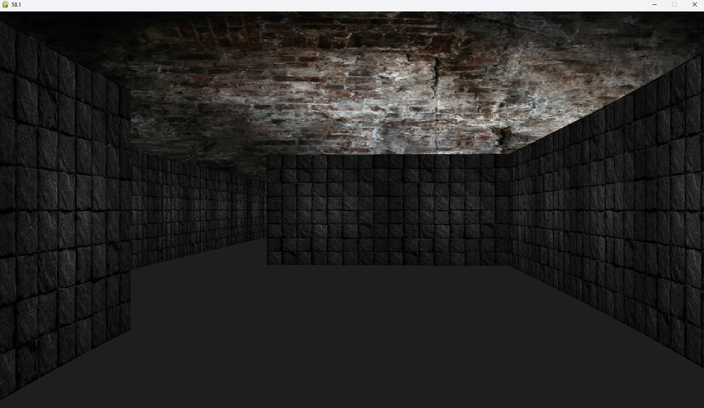](images/test_evidence/epic_1/menu_new_game_screen.png)                                                                                                                                             | YES     |
| EPIC1/US1.3 | TC-10        | Verify menu navigation                                                              | Main menu displayed. Player clicks “LEADERBOARD” button.                                                                                                                                                                                                                                                                                          | Game transitions from menu to leaderboard screen.                                                                                                                                                                                                                                                                                                                               | When the user clicks on the "LEADERBOARD" button, they are transferred onto the leaderboard screen where they can see the leaderboard of all players.                                                                                                                                                                                                    | [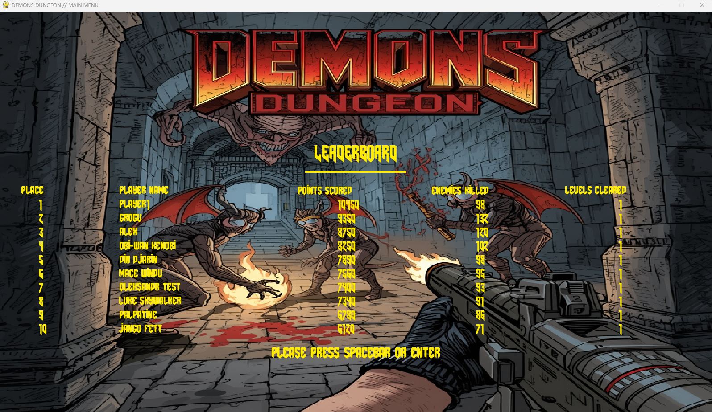](images/test_evidence/epic_1/menu_leaderboard_screen.png)                                                                                                                                       | YES     |
| EPIC1/US1.3 | TC-11        | Verify menu navigation                                                              | Main menu displayed. Player clicks “GAME CREDITS” button.                                                                                                                                                                                                                                                                                         | Game transitions from menu to game credits screen.                                                                                                                                                                                                                                                                                                                              | When the user clicks on the "GAME CREDITS" button, they are transferred onto the game credits screen.                                                                                                                                                                                                                                                    | [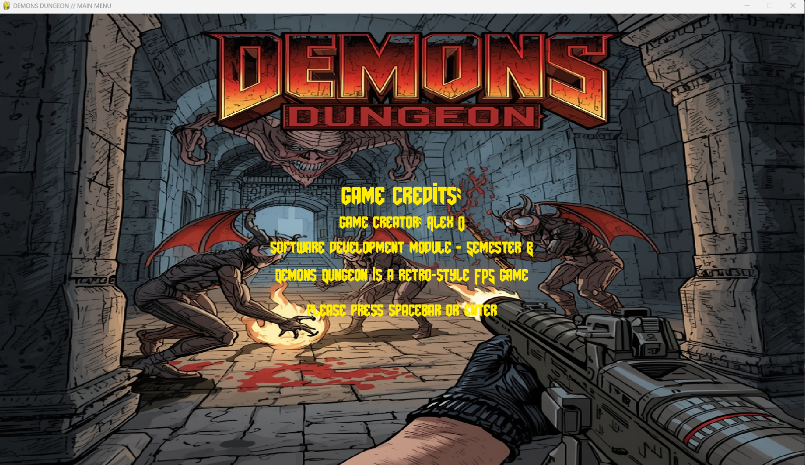](images/test_evidence/epic_1/menu_game_credits_screen.png)                                                                                                                                     | YES     |
| EPIC1/US1.3 | TC-12        | Verify menu navigation                                                              | Main menu displayed. Player clicks “QUIT GAME” button                                                                                                                                                                                                                                                                                             | Game transitions from menu to exit the game.                                                                                                                                                                                                                                                                                                                                    | When the user clicks on the "QUIT GAME" button, the user exits the game and the game window is closed and the user is returned back onto the operating system.                                                                                                                                                                                           |                                                                                                                                                                                                                                                                                    | YES     |
| EPIC2/US2.1 | TC-13        | Verify raycasting view rendering                                                    | Game started                                                                                                                                                                                                                                                                                                                                      | Dungeon walls visible with proper perspective                                                                                                                                                                                                                                                                                                                                   | Dungeon walls are visible with proper perspective                                                                                                                                                                                                                                                                                                        | [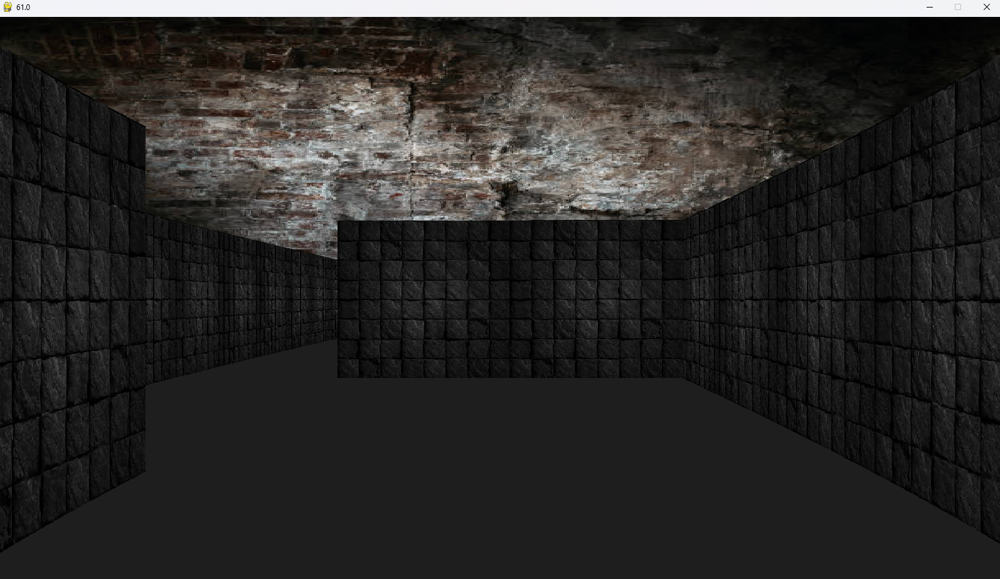](images/test_evidence/epic_1/game_rendering.png)                                                                                                                                                         | YES     |
| EPIC2/US2.1 | TC-14        | Verify FPS performance                                                              | Game running > 5 min                                                                                                                                                                                                                                                                                                                              | FPS ≥ 60, no freeze or crash                                                                                                                                                                                                                                                                                                                                                    | FPS can be seen in the top left corner of the game screen                                                                                                                                                                                                                                                                                                | [](images/test_evidence/epic_1/game_rendering.png)                                                                                                                                                         | YES     |
| EPIC4/US4.2 | TC-18        | Verify player's health changes                                                      | Demon attacks player so player's health decreases                                                                                                                                                                                                                                                                                                 | HUD updates in real time showing decrease in player's health                                                                                                                                                                                                                                                                                                                    | The player's health on HUD decreases when the player is attacked.                                                                                                                                                                                                                                                                                        | [](images/test_evidence/epic_4/hud_health_update.png)                                                                                                                                                   | YES     |
| EPIC4/US4.2 | TC-20        | Verify player ammo decreases on HUD                                                 | When a demon attacks and the player shoots the demon, the amount of ammo decreases.                                                                                                                                                                                                                                                               | HUD updates in real time showing decrease in player's ammo                                                                                                                                                                                                                                                                                                                      | The HUD ammo decreases when the player is shooting at demons.                                                                                                                                                                                                                                                                                            | [](images/test_evidence/epic_4/hud_updated_ammo_changes.png)                                                                                                                                     | YES     |
| EPIC4/US4.3 | TC-21        | Verify player kill count increase on HUD                                            | When a demon is attacking the player and the player kills the demon, the kill count increases by one.                                                                                                                                                                                                                                             | HUD updates in real time showing increase in player's kill count                                                                                                                                                                                                                                                                                                                | The HUD kill account updates when the player kills a demon.                                                                                                                                                                                                                                                                                              | [](images/test_evidence/epic_4/hud_kill_account_update.png)                                                                                                                                       | YES     |
| EPIC4/US4.3 | TC-22        | Verify player score increase on HUD                                                 | When the player kills a demon, their score should increase to 100.                                                                                                                                                                                                                                                                                | Player's score jumps to 100 upon killing a demon.                                                                                                                                                                                                                                                                                                                               | The player's score increases to 100 upon killing the demon                                                                                                                                                                                                                                                                                               | [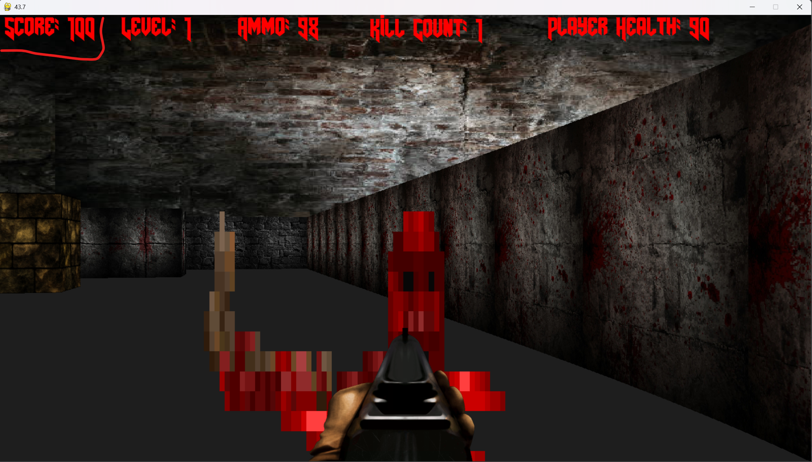](images/test_evidence/epic_4/player_score_increase.png)                                                                                                                                           | YES     |
| EPIC5/US5.1 | TC-23        | Verify shotgun animation                                                            | When the player starts the game, the shotgun should be animated on the screen and visible to the user.                                                                                                                                                                                                                                            | Shotgun is animated on the screen in real time.                                                                                                                                                                                                                                                                                                                                 | The shotgun is displayed on the screen in the player's hands.                                                                                                                                                                                                                                                                                            | [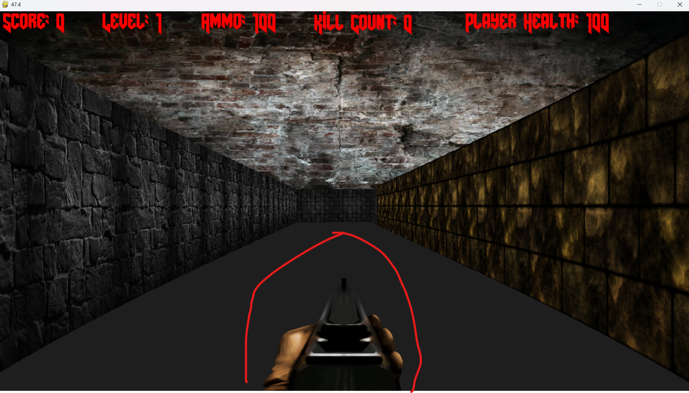](images/test_evidence/epic_5/shotgun_displayed.png)                                                                                                                                                   | YES     |
| EPIC5/US5.3 | TC-24        | Verify shotgun shooting animation                                                   | When the player shoots a demon with the shotgun, there has to be an animation of the shooting                                                                                                                                                                                                                                                     | Shotgun shooting is animated on the screen in real time.                                                                                                                                                                                                                                                                                                                        | The shotgun shooting animation is played when the shotgun is shot                                                                                                                                                                                                                                                                                        | [](images/test_evidence/epic_5/shotgun_shooting_animation.mp4)                                                                                                                                 | YES     |
| EPIC5/US5.2 | TC-25        | Verify shotgun shooting sound                                                       | When the player shoots a demon with the shotgun, there has to be a shooting sound played when the shotgun is fired.                                                                                                                                                                                                                               | Shotgun shooting sound is played in real time.                                                                                                                                                                                                                                                                                                                                  | The shotgun shooting sound is played when the shotgun is shot                                                                                                                                                                                                                                                                                            | [](images/test_evidence/epic_5/shotgun_shooting_animation.mp4)                                                                                                                                 | YES     |
| EPIC5/US5.4 | TC-26        | Verify player damage mechanics                                                      | When the player enters close proximity and is attacked by the demon, player pain sound should be played and blood screen should be flashing                                                                                                                                                                                                       | Player pain sound is played and blood screen is flashing in real time.                                                                                                                                                                                                                                                                                                          | Player pain sound is played and the flashing blood screen is rendered.                                                                                                                                                                                                                                                                                   | [](images/test_evidence/epic_3/player_pain_sound_and_flashing_blood_screen_mechanics.mp4)                                                                           | YES     |
| EPIC3/US3.2 | TC-27        | Verify demon rendering                                                              | When the player reaches the location of the demon, the demon is rendered clearly on the screen.                                                                                                                                                                                                                                                   | Player find the location of the demon.                                                                                                                                                                                                                                                                                                                                          | The demon is rendered clearly on the game screen.                                                                                                                                                                                                                                                                                                        | [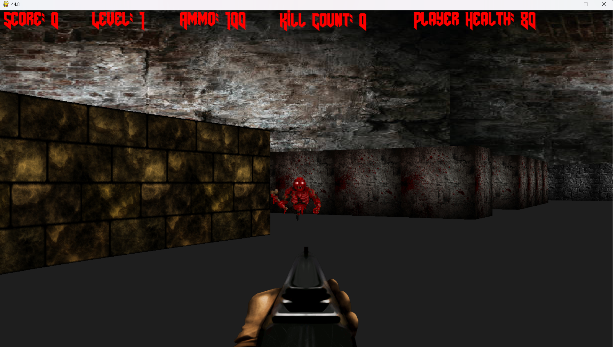](images/test_evidence/epic_3/demon_rendering.png)                                                                                                                                                       | YES     |
| EPIC5/US5.5 | TC-28        | Verify demon combat mechanics                                                       | When the player encounters the demon, the demon attacks the player and its attack sound is played and the attack animation is played. When the player injures the demon, demon pain sound is played and pain sprite is rendered and when the player kills the demon, demon's sound of death is played and the demon's death animation is rendered | When the demon attacks the player, the attack sound should be played and the attack animation should be rendered. When the player injures the demon, the demon's pain sound should be played and the demon's pain animation should be played. When the player kills the demon, the demon's sound of death should be played and the demon's animation of death should be played. | When the demon attacks the player, the attack sound is played and the attack animation is be rendered as expected. When the player injures the demon, the demon's pain sound is played and the demon's pain animation is rendered. When the player kills the demon, the demon's sound of death is played and the demon's animation of death is rendered. | [](images/test_evidence/epic_5/demon_death.mp4)                                                                                                                                                               | YES     |
| EPIC9       | TC-23        | Verify ambient music & sound                                                        | Game active                                                                                                                                                                                                                                                                                                                                       | Horror ambient and sound effects play correctly                                                                                                                                                                                                                                                                                                                                 | As soon as the game starts, ambient Doom horror music starts playing correctly while the player proceeds to play the game.                                                                                                                                                                                                                               | [](images/test_evidence/epic_9/ambient_horror_music.mp4)                                                                                                                                             | YES     |
| EPIC3/US3.2 | TC-24        | Verify demon chase behavior                                                         | Player enters detection radius                                                                                                                                                                                                                                                                                                                    | Demon moves toward player, attacks                                                                                                                                                                                                                                                                                                                                              | As soon as the player is within range, the demon moves to attack and attacks the player which can be seen by the demon's attack animations and the flashing blood screen                                                                                                                                                                                 | [](images/test_evidence/epic_3/demon_chase_behaviour.mp4)                                                                                                                                           | YES     |
| EPIC4       | TC-25        | Verify health decrease and regenerate                                               | Player hit by enemy                                                                                                                                                                                                                                                                                                                               | Health decreases, then slowly regenerates over time                                                                                                                                                                                                                                                                                                                             | When the demons attack the player, the player's health decreases and when the player hides or avoids the demons, the player's health regenerates.                                                                                                                                                                                                        | [](images/test_evidence/epic_4/player_health_decrease_and_regeneration.mp4)                                                                                                       | YES     |
| EPIC6       | TC-26        | Verify win condition                                                                | Boss defeated and exit door is reached by the player                                                                                                                                                                                                                                                                                              | Victory screen is shown                                                                                                                                                                                                                                                                                                                                                         | As soon as the player kills boss demon and reaches the exit door, the victory screen is shown with the "Victory" label in Doom style.                                                                                                                                                                                                                    | [](images/test_evidence/epic_6/victory_screen.png)                                                                                                                                                         | YES     |
| EPIC6       | TC-27        | Verify lose condition                                                               | Health reaches 0                                                                                                                                                                                                                                                                                                                                  | Game Over screen displayed                                                                                                                                                                                                                                                                                                                                                      | When the player is killed, a bloody horror "Game Over" screen is displayed.                                                                                                                                                                                                                                                                              | [](images/test_evidence/epic_6/lose_screen.mp4)                                                                                                                                                               | YES     |
| EPIC3/US3.2 | TC-28        | Verify Blood demon rendering and animations (Attack, idle, walk, pain, death)       | Player engages in combat with Blood Demon                                                                                                                                                                                                                                                                                                         | Blood Demon is rendered correctly when idle, attacking, walking, being shot and dying.                                                                                                                                                                                                                                                                                          | Blood Demon is rendered correctly when idle, attacking, walking, being shot and dying.                                                                                                                                                                                                                                                                   | [](images/test_evidence/epic_3/blood_demon_encounter.mp4)                                                                                                                                           | YES     |
| EPIC3/US3.2 | TC-29        | Verify Abaddon demon rendering and animations (Attack, idle, walk, pain, death)     | Player engages in combat with Abaddon Demon                                                                                                                                                                                                                                                                                                       | Abaddon Demon is rendered correctly when idle, attacking, walking, being shot and dying.                                                                                                                                                                                                                                                                                        | Abaddon Demon is rendered correctly when idle, attacking, walking, being shot and dying.                                                                                                                                                                                                                                                                 | [](images/test_evidence/epic_3/abaddon_demon_encounter.mp4)                                                                                                                                       | YES     |
| EPIC3/US3.2 | TC-30        | Verify Afrit Demon rendering and animations (Attack, idle, walk, pain, death)       | Player engages in combat with Afrit Demon                                                                                                                                                                                                                                                                                                         | Afrit Demon is rendered correctly when idle, attacking, walking, being shot and dying.                                                                                                                                                                                                                                                                                          | Afrit Demon is rendered correctly when idle, attacking, walking, being shot and dying.                                                                                                                                                                                                                                                                   | [](images/test_evidence/epic_3/afrit_demon_encounter.mp4)                                                                                                                                           | YES     |
| EPIC3/US3.2 | TC-31        | Verify Annihilator Demon rendering and animations (Attack, idle, walk, pain, death) | Player engages in combat with Annihilator Demon                                                                                                                                                                                                                                                                                                   | Annihilator Demon is rendered correctly when idle, attacking, walking, being shot and dying.                                                                                                                                                                                                                                                                                    | Annihilator Demon is rendered correctly when idle, attacking, walking, being shot and dying.                                                                                                                                                                                                                                                             | [](images/test_evidence/epic_3/annihilator_demon_encounter.mp4)                                                                                                                               | YES     |
| EPIC3/US3.2 | TC-32        | Verify Blood Ghost Demon rendering and animations (Attack, idle, walk, pain, death) | Player engages in combat with Blood Ghost Demon                                                                                                                                                                                                                                                                                                   | Blood Ghost Demon is rendered correctly when idle, attacking, walking, being shot and dying.                                                                                                                                                                                                                                                                                    | Blood Ghost Demon is rendered correctly when idle, attacking, walking, being shot and dying.                                                                                                                                                                                                                                                             | [](images/test_evidence/epic_3/blood_ghost_demon_encounter.mp4)                                                                                                                               | YES     |
| EPIC1/US1.3 | TC-33        | Verify leaderboard is updated with player's score                                   | Game finishes with win or lose condition                                                                                                                                                                                                                                                                                                          | Player's score has to be updated into leaderboard if reaches Top 10.                                                                                                                                                                                                                                                                                                            | Player's score has to be updated into leaderboard if reaches Top 10.                                                                                                                                                                                                                                                                                     | [](images/test_evidence/epic_1/leaderboard_update.png), [](images/test_evidence/epic_1/player_name_registration.png) | YES     |
| EPIC9       | TC-34        | Verify blue torch ambient object is animated correctly from its sprites.            | Player plays the game and blue torch is in line of sight.                                                                                                                                                                                                                                                                                         | Blue torch is animated from its sprites correctly.                                                                                                                                                                                                                                                                                                                              | Blue torch is animated successfully showing flickering blue flame.                                                                                                                                                                                                                                                                                       | [](images/test_evidence/epic_9/blue_torch_test_case.png)                                                                                                                                             | YES     |
| EPIC9       | TC-35        | Verify green torch ambient object is animated correctly from its sprites.           | Player plays the game and green torch is in line of sight.                                                                                                                                                                                                                                                                                        | Green torch is animated from its sprites correctly.                                                                                                                                                                                                                                                                                                                             | Green torch is animated successfully showing flickering green flame.                                                                                                                                                                                                                                                                                     | [](images/test_evidence/epic_9/green_torch_test_case.png)                                                                                                                                           | YES     |
| EPIC9       | TC-36        | Verify blue stone torch ambient object is animated correctly from its sprites.      | Player plays the game and blue stone torch is in line of sight.                                                                                                                                                                                                                                                                                   | Blue stone torch is animated from its sprites correctly.                                                                                                                                                                                                                                                                                                                        | Blue stone torch is animated successfully showing flickering blue flame.                                                                                                                                                                                                                                                                                 | [](images/test_evidence/epic_9/blue_stone_torch_test_case.png)                                                                                                                                 | YES     |
| EPIC9       | TC-37        | Verify black torch ambient object is animated correctly from its sprites.           | Player plays the game and black torch is in line of sight.                                                                                                                                                                                                                                                                                        | Black torch is animated from its sprites correctly.                                                                                                                                                                                                                                                                                                                             | Black torch is animated successfully showing flickering orange flame.                                                                                                                                                                                                                                                                                    | [](images/test_evidence/epic_9/black_torch_test_case.png)                                                                                                                                           | YES     |
| EPIC9       | TC-38        | Verify hexen candle ambient object is animated correctly from its sprites.          | Player plays the game and hexen candle is in line of sight.                                                                                                                                                                                                                                                                                       | Hexen candle torch is animated from its sprites correctly.                                                                                                                                                                                                                                                                                                                      | Hexen candle is animated successfully showing flickering flame.                                                                                                                                                                                                                                                                                          | [](images/test_evidence/epic_9/hexen_candle_test_case.png)                                                                                                                                         | YES     |
| EPIC9       | TC-39        | Verify fire blu torch ambient object is animated correctly from its sprites.        | Player plays the game and fire blu torch is in line of sight.                                                                                                                                                                                                                                                                                     | Fire blu torch is animated from its sprites correctly.                                                                                                                                                                                                                                                                                                                          | Fire blue torch is animated successfully showing flickering flame.                                                                                                                                                                                                                                                                                       | [](images/test_evidence/epic_9/fire_blu_torch_test_case.png)                                                                                                                                    | YES     |
| EPIC9       | TC-40        | Verify red torch ambient object is animated correctly from its sprites.             | Player plays the game and red torch is in line of sight.                                                                                                                                                                                                                                                                                          | Red torch is animated from its sprites correctly.                                                                                                                                                                                                                                                                                                                               | Red torch is animated successfully showing flickering red flame.                                                                                                                                                                                                                                                                                         | [](images/test_evidence/epic_9/red_torch_test_case.png)                                                                                                                                               | YES     |

---

## Software tools and coding techniques used

The following software tools and coding techniques were used in the development of the game:
1. Python 3.12 programming language for game development.
2. PyGame library for game development and rendering.
3. SLADE editor for map design and working with WAD files.
4. PyCharm IDE for code development and debugging.
5. Microsoft Excel for game level design and burndown chart creation.
6. Notepad++ for JSON file editing and management.
7. Version control using Git and GitHub for code management.
8. Object-oriented programming techniques for game structure and design.

---

## Evaluation of the game development process and final product

As the result of the successful project management process and game development process, a Doom-style 3D first-person shooter game has been successfully created using Python and PyGame. The game features a player navigating through a maze-like game level, encountering various demons, and engaging in combat.  

All of the 'Must Have' features have been implemented successfully, including player movement, shooting mechanics, enemy AI and combat, health management, and win/lose conditions. The game also includes all 'Should Have' features such as HUD, main menu, multiple enemy types and visual and audio feedback. From the 'Could Have' features, the game includes a leaderboard to track player scores and a variety of ambient objects in the form of flickering torches and candles to create a more immersive environment. 

Following the outlined design and development strategies the game was implemented in a structured and modular manner, adhering to the principles of object-oriented programming and utilizing the capabilities of the PyGame library effectively. The game was developed iteratively, with regular testing and feedback incorporated into the development process to ensure that the final product meets the specified requirements and provides an engaging gaming experience.

Lastly the game has been thoroughly tested against the defined test cases, and all test cases have passed successfully, indicating that the game functions as intended and meets the specified user and system requirements.


---

## References

1. Free Doom-style font: https://fontmeme.com/fonts/amazdoom-font/
2. SLADE editor for map design and working with WAD files: https://slade.mancubus.net/
3. Pygame documentation: https://www.pygame.org/docs/
4. Doom-style weapon sprites: https://www.realm667.com/repository/armory/doom-style
6. Sprites for monsters: https://www.realm667.com/repository/beastiary/doom-style
7. Sprites for the ambient objects: https://www.realm667.com/repository/prop-stop/light-sources
8. Kinsley, H. and McGugan, W. (2015) Beginning Python Games Development: With Pygame. 2nd edn. New York: Apress. Available at: https://learning.oreilly.com/library/view/beginning-python-games/9781484209707/?sso_link=yes&sso_link_from=UnivofHerts
9. Kelly, S. (2019) Python, PyGame, and Raspberry Pi Game Development. New York: Apress. Available at: https://learning.oreilly.com/library/view/python-pygame-and/9781484245330/?sso_link=yes&sso_link_from=UnivofHerts
10. Rodas de Paz, A. and Howse, J. (2015) Python Game Programming By Example. Birmingham: Packt Publishing. Available at: https://learning.oreilly.com/library/view/python-game-programming/9781785281532/
11. Craven, P. V. (2015) Program Arcade Games: With Python and Pygame. 4th edn. New York: Apress. Available at: https://learning.oreilly.com/library/view/program-arcade-games/9781484217900/?sso_link=yes&sso_link_from=UnivofHerts
12. Kinsley, H. and McGugan, W. (2015) Beginning Python Games Development: With Pygame. 2nd edn. New York: Apress. Available at: https://learning.oreilly.com/library/view/beginning-python-games/9781484209707/?sso_link=yes&sso_link_from=UnivofHerts
13. Zubair, H. (2024) Computer Graphics: Toronto Academic Press: Available at: https://ebookcentral.proquest.com/lib/herts/detail.action?docID=31545581
14. Learning course: Game Development with PyGame: Write Your Own Games, Simulations, and Demonstrations with Python, Available at: https://learning.oreilly.com/course/game-development-with/9781484256619/
